# Expensio Finance Screenshot Gallery

Screenshots are organized by product feature and use descriptive, lowercase filenames. Paths are stable so they can be referenced from project documentation.

## Core Finance

### Dashboard

### Expenses

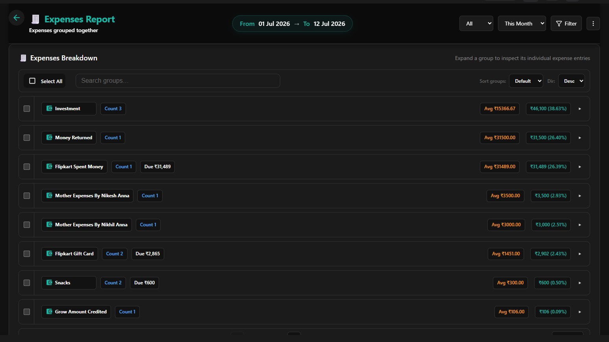

### Categories

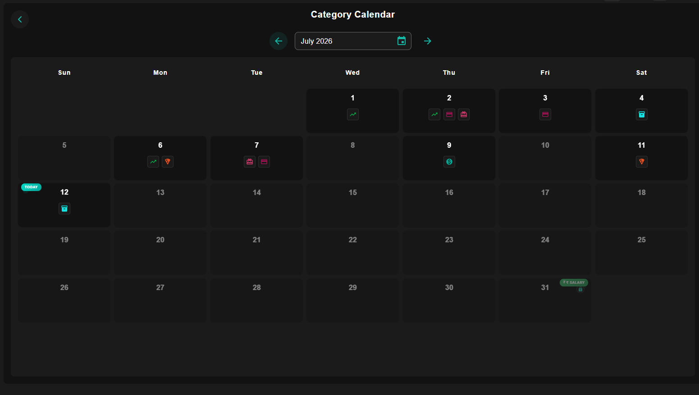

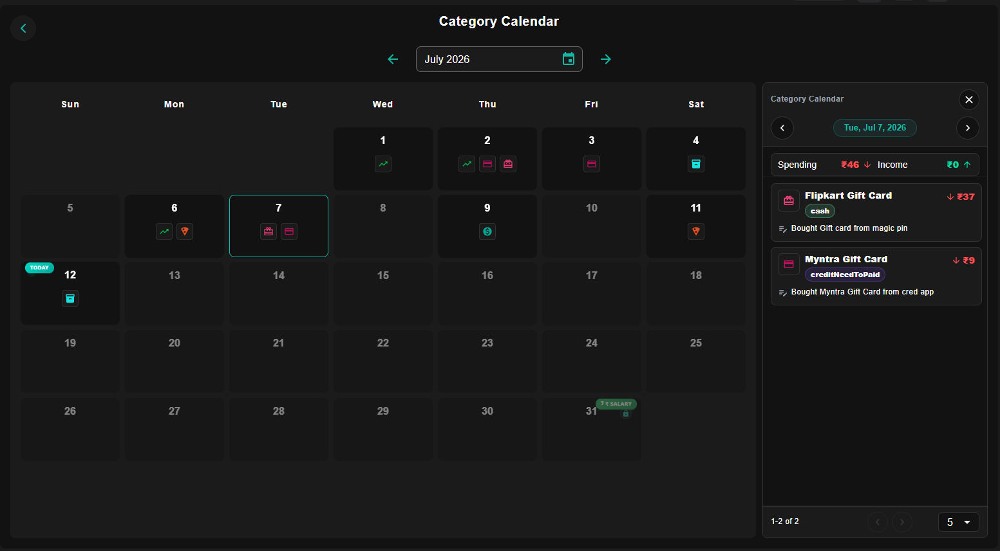

### Payment Methods, Bills, and Budgets

## Collaboration and Sharing

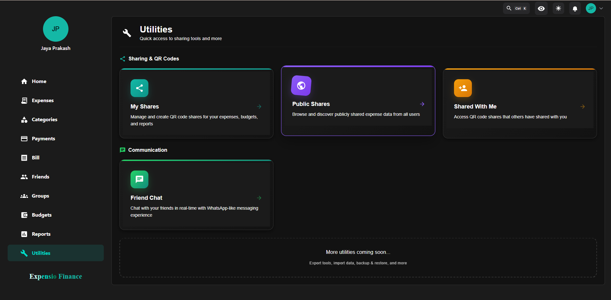

## Reports and Profile

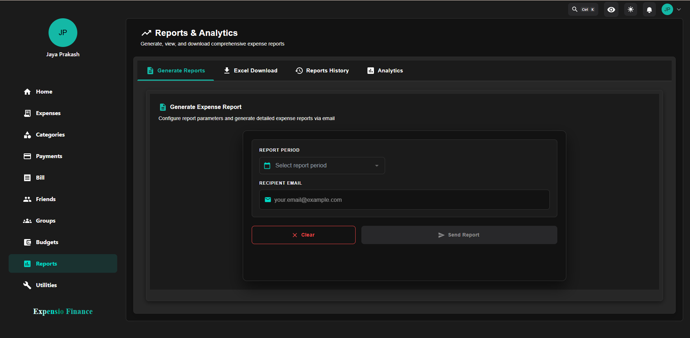

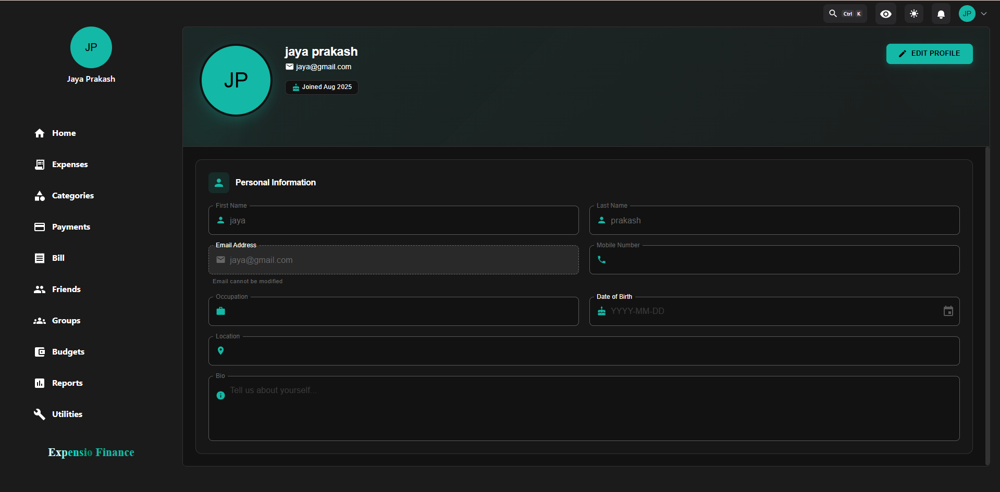

## Settings

| Section | Preview |
|---|---|
| Appearance |  |
| Preferences | 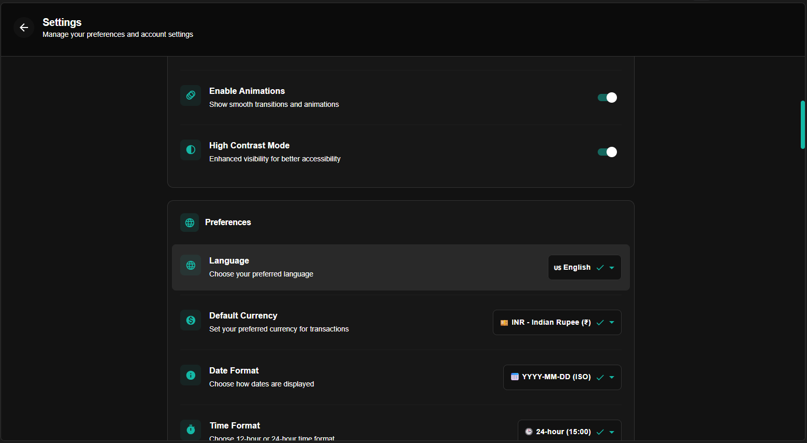 |
| Privacy and security | 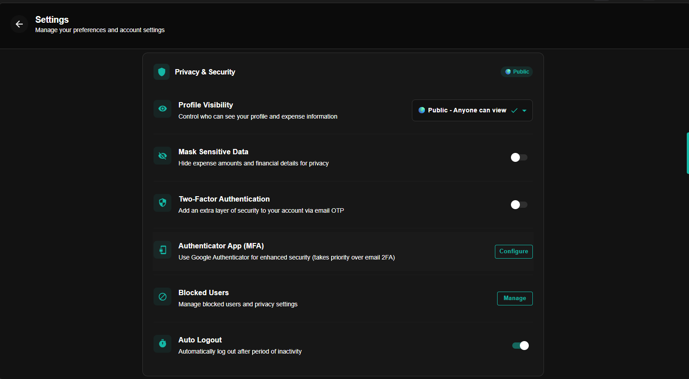 |
| Data and storage | 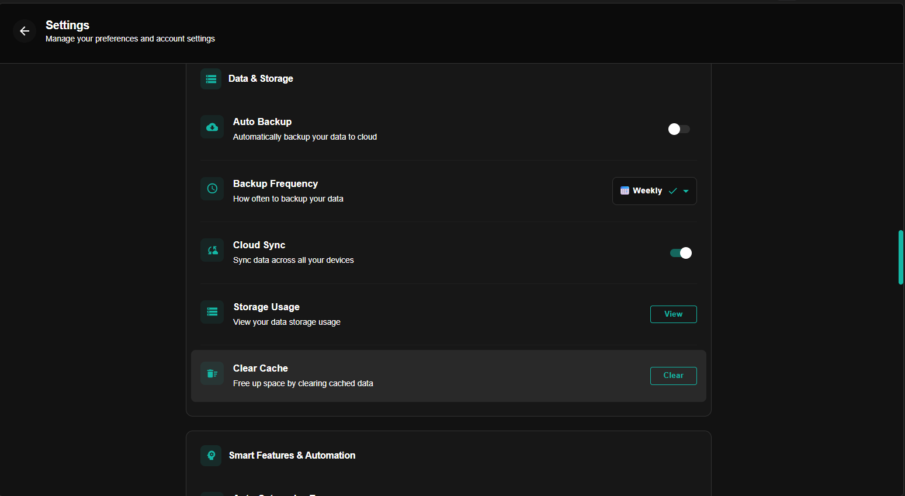 |
| Smart features | 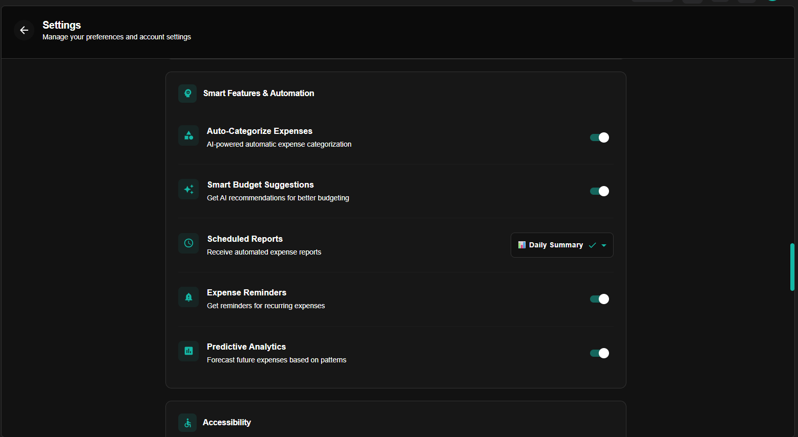 |
| Accessibility | 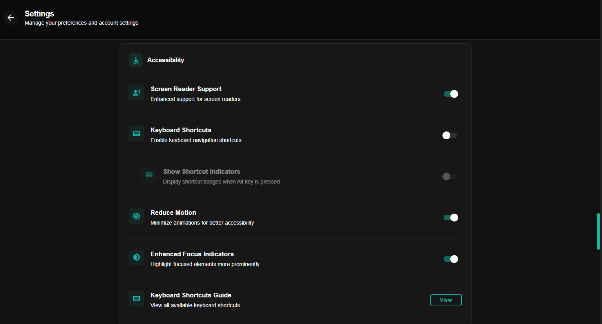 |
| Account management | 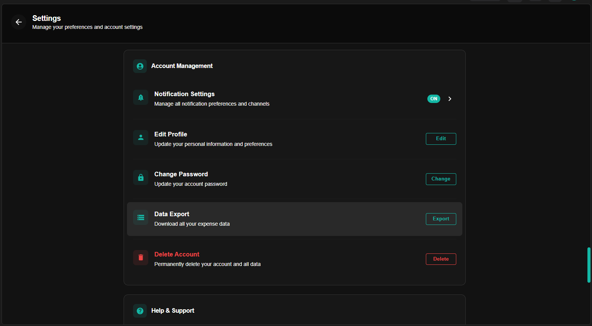 |
| Help and about | 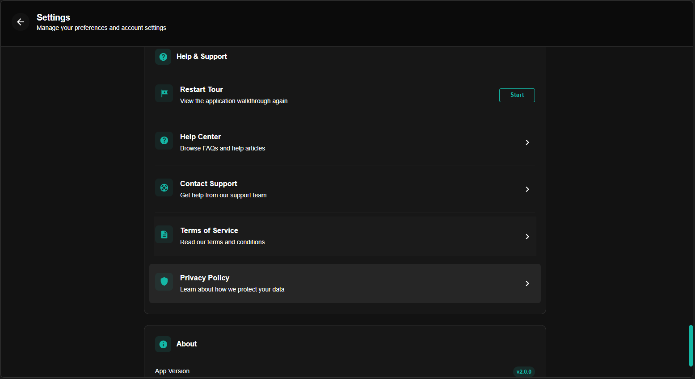 |

## Administration

| Area | Preview |
|---|---|
| Dashboard | 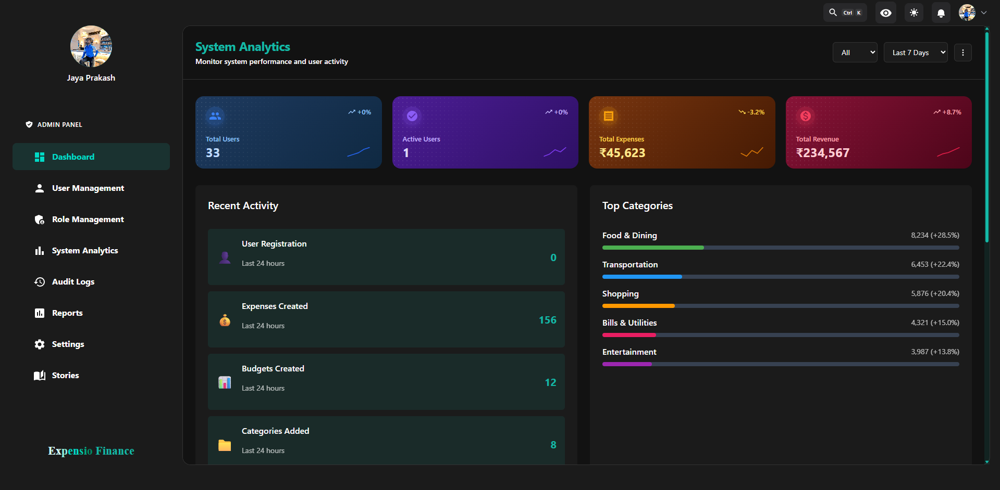 |
| Analytics | 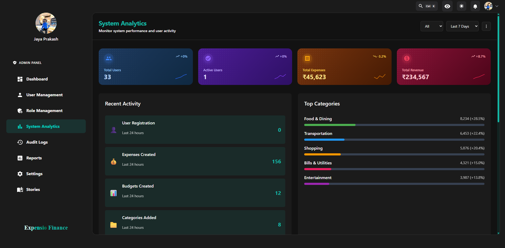 |
| Users |  |
| Roles | 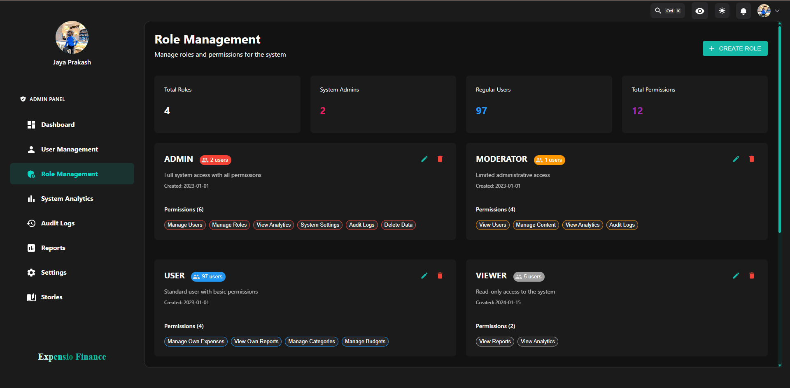 |
| Audit logs | 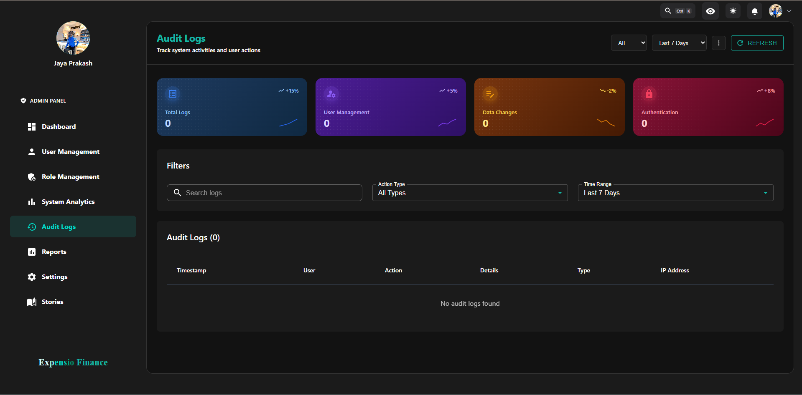 |
| Reports | 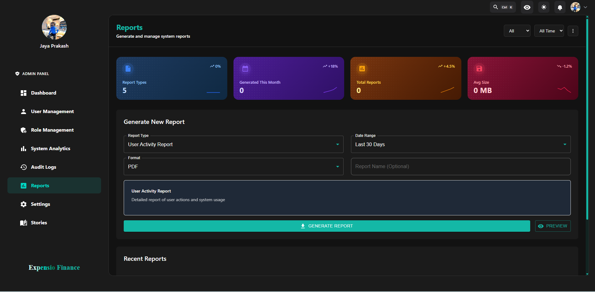 |
| Stories | 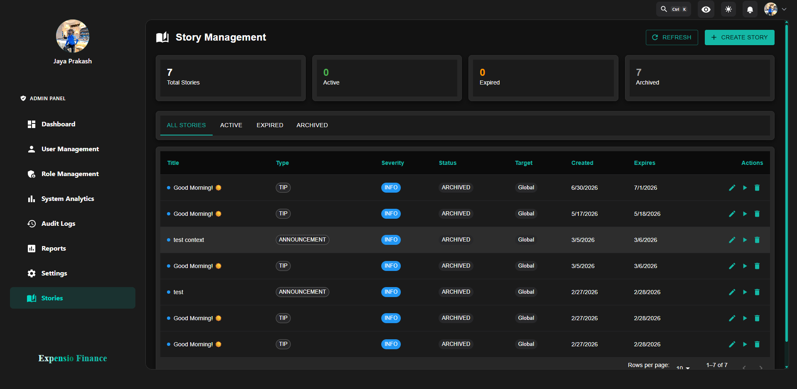 |

## Adding Screenshots

1. Place the image under the matching `screenshots/<feature>/` folder.
2. Use a short lowercase kebab-case name describing the screen or state.
3. Avoid dates, spaces, and generic names such as `Screenshot.png`.
4. Add meaningful alt text and a reference in this gallery.

Useful additions would be authentication, chat, upload/import, create/edit forms, mobile layouts, and light-theme screens.
