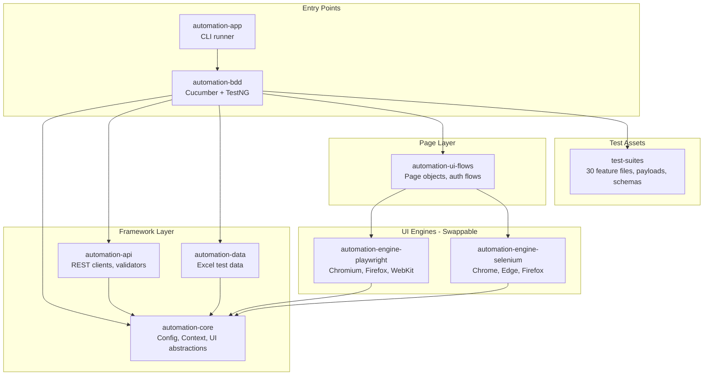
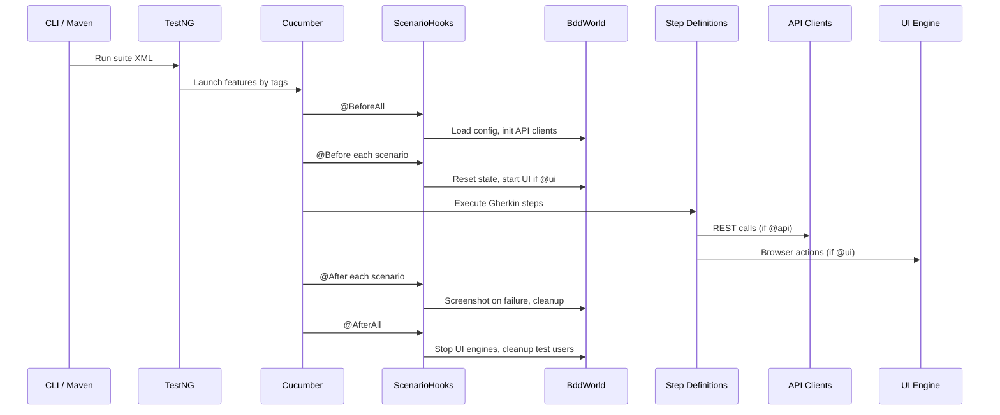
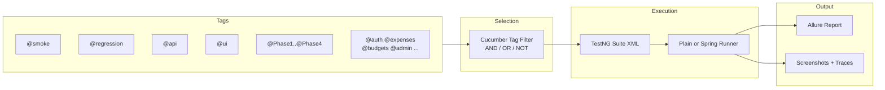
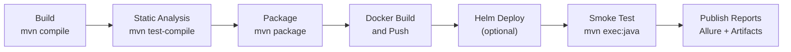

# Expense Tracking -- Automation Suite

A multi-module Maven BDD framework for **API and UI testing** of the Expense Tracking System. Supports dual UI engines (Playwright / Selenium), data-driven scenarios via Excel, and full CI/CD integration through Jenkins, Docker, and Helm.


---

## Table of Contents

- [Architecture](#architecture)
- [Module Reference](#module-reference)
- [Test Execution Flow](#test-execution-flow)
- [Test Coverage Matrix](#test-coverage-matrix)
- [Quick Start](#quick-start)
- [Configuration Reference](#configuration-reference)
- [CI/CD Pipeline](#cicd-pipeline)
- [Docker and Helm](#docker-and-helm)
- [Writing New Tests](#writing-new-tests)
- [Tools](#tools)
- [Related Documentation](#related-documentation)

---

## Architecture



The framework follows a layered architecture:

- **Entry points** accept CLI arguments or Maven commands and delegate to Cucumber via TestNG.
- **Framework layer** provides configuration loading, test context management, API execution, and test data resolution.
- **UI engines** are swappable at runtime via the `automation.engine` property -- switch between Playwright and Selenium without changing test code.
- **Page layer** defines page objects and UI flows that consume the engine abstraction.
- **Test assets** contain the Gherkin feature files, request payloads, expected fragments, and JSON schemas.

---

## Module Reference

| Module | Path | Purpose | Key Classes |
|--------|------|---------|-------------|
| **automation-core** | `automation-core/` | Config, context, logging, UI abstractions | `AutomationConfig`, `ConfigLoader`, `UiEngine`, `TestContext`, `RetryExecutor`, `PollingWait` |
| **automation-api** | `automation-api/` | REST API test clients and validation | `ApiEndpointRegistry` (100+ endpoints), `ApiRequestExecutor`, `ApiResponseValidator`, `ApiClient`, 10 domain API clients |
| **automation-bdd** | `automation-bdd/` | Cucumber runners, step definitions, hooks | `ScenarioHooks`, `ApiCleanupHooks`, `BddWorld`, `GenericApiSteps`, `UserApiSteps`, `AuthUiSteps`, `ExpenseUiSteps` |
| **automation-engine-playwright** | `automation-engine-playwright/` | Playwright browser automation | `PlaywrightUiEngine`, `PlaywrightBrowserFactory`, `PlaywrightElementActions`, `PlaywrightScreenshotService` |
| **automation-engine-selenium** | `automation-engine-selenium/` | Selenium WebDriver automation | `SeleniumUiEngine`, `SeleniumDriverFactory`, `SeleniumElementActions`, `SeleniumScreenshotService` |
| **automation-ui-flows** | `automation-ui-flows/` | Page objects and auth flows | 11 page objects (`LoginPage`, `DashboardPage`, `ExpensesPage`, etc.), `AuthUiFlowService`, `TabRouteRegistry`, `UiActionRegistry` |
| **automation-data** | `automation-data/` | Excel-based test data management | `ExcelWorkbookReader`, `ExcelDatasetResolver`, `ExcelSchemaValidator` |
| **test-suites** | `test-suites/` | Feature files, payloads, schemas, config | 30 `.feature` files, request templates, expected fragments, JSON schemas, `suite-data.properties` |
| **automation-app** | `automation-app/` | CLI runner and boot orchestration | `AutomationApp`, `CliOptionsParser`, `TestExecutionLauncher`, `HealthCheckOrchestrator`, `CommandRunner` |
| **Parent POM** | `pom.xml` | Dependency management and plugin config | Versions: Selenium 4.28, Playwright 1.57, RestAssured 5.5, Cucumber 7.21, TestNG 7.11, Allure 2.24 |

### API Clients

| Client | Target Service | Key Endpoints |
|--------|---------------|---------------|
| `AuthApiClient` | User Service | `/auth/signin`, `/auth/signup`, `/auth/verify-mfa`, `/auth/verify-login-otp` |
| `UserProfileApiClient` | User Service | `/api/users/profile`, `/api/users/update`, `/api/users/delete` |
| `ExpenseApiClient` | Expense Service | `/api/expenses`, `/api/expenses/{id}` |
| `BudgetApiClient` | Budget Service | `/api/budgets` |
| `FriendshipApiClient` | Friendship Service | `/api/friendships` |
| `GroupApiClient` | Friendship Service | `/api/groups` |
| `SharingApiClient` | Expense Service | `/api/shares` |
| `EventApiClient` | Event Service | `/api/events` |
| `ChatApiClient` | Chat Service | `/api/chat` |
| `PresenceApiClient` | Chat Service | `/api/presence` |

---

## Test Execution Flow



### Lifecycle Details

| Phase | Hook | What Happens |
|-------|------|-------------|
| **Suite init** | `@BeforeAll` | `BddWorld` loads `AutomationConfig`, creates API clients (`AuthApiClient`, etc.), resolves suite data from `suite-data.properties` |
| **Scenario setup** | `@Before` | Resets `ScenarioState`, authenticates if `@requiresCredentials`, starts UI engine if `@ui` tag present |
| **Step execution** | -- | `GenericApiSteps` / `UserApiSteps` for API; `AuthUiSteps` / `ExpenseUiSteps` for UI; `HybridApiSteps` / `HybridUiSteps` for mixed |
| **Scenario teardown** | `@After` | Captures screenshot on failure, logs step execution summary, runs `ApiCleanupHooks` for `@api` scenarios |
| **Suite cleanup** | `@AfterAll` | Stops Playwright/Selenium, deletes test users created during signup tests |

### Runners

| Runner | Class | Use Case |
|--------|-------|----------|
| **Plain** | `AutomationCucumberTest` | Standalone TestNG + Cucumber, no Spring context |
| **Spring** | `SpringBootCucumberTest` | Spring Boot DI for API clients, config injection |

---

## Test Coverage Matrix

### Auth (UI)

| Feature File | Scenarios | Tags | Type |
|-------------|-----------|------|------|
| `auth/ui/login.feature` | 3 | `@auth @ui @smoke @regression` | UI |
| `auth/ui/signup.feature` | 3 | `@auth @ui @signup @smoke @regression` | UI |
| `auth/ui/otp_mfa_skeleton.feature` | 2 | `@auth @ui @otp @mfa @regression` | UI |

### Auth (API)

| Feature File | Scenarios | Tags | Type |
|-------------|-----------|------|------|
| `auth/api/auth_api.feature` | 2 | `@auth @api @smoke @regression` | API |

### User Service API -- Auth

| Feature File | Scenarios | Tags | Type |
|-------------|-----------|------|------|
| `api/user-service/auth/auth_signin.feature` | 3 | `@api @auth @Phase1 @smoke` | API |
| `api/user-service/auth/auth_signup.feature` | 3 | `@api @auth @Phase1 @smoke` | API |
| `api/user-service/auth/auth_token_lifecycle.feature` | 6 | `@api @auth @Phase1 @smoke` | API |
| `api/user-service/auth/auth_password_reset.feature` | 2 | `@api @auth @Phase1 @regression` | API |
| `api/user-service/auth/auth_otp.feature` | 7 | `@api @auth @Phase1 @smoke` | API |
| `api/user-service/auth/auth_mfa.feature` | 7 | `@api @auth @mfa @Phase1 @regression` | API |
| `api/user-service/auth/auth_oauth2.feature` | 3 | `@api @auth @Phase1 @smoke` | API |

### User Service API -- User Management

| Feature File | Scenarios | Tags | Type |
|-------------|-----------|------|------|
| `api/user-service/user/user_crud.feature` | 5 | `@api @Phase2 @smoke @regression` | API |
| `api/user-service/user/user_profile.feature` | 6 | `@api @Phase2 @smoke @regression` | API |
| `api/user-service/user/user_roles.feature` | 4 | `@api @admin @Phase2 @smoke` | API |
| `api/user-service/user/user_mode.feature` | 3 | `@api @Phase2 @smoke` | API |

### User Service API -- Admin

| Feature File | Scenarios | Tags | Type |
|-------------|-----------|------|------|
| `api/user-service/admin/role_crud.feature` | 6 | `@api @admin @Phase3 @smoke` | API |
| `api/user-service/admin/admin_user_management.feature` | 9 | `@api @admin @Phase3 @smoke` | API |
| `api/user-service/admin/admin_analytics.feature` | 7 | `@api @admin @Phase3 @smoke` | API |

### User Service API -- Preferences

| Feature File | Scenarios | Tags | Type |
|-------------|-----------|------|------|
| `api/user-service/preferences/report_preferences.feature` | 5 | `@api @preferences @Phase4 @smoke` | API |

### Expenses

| Feature File | Scenarios | Tags | Type |
|-------------|-----------|------|------|
| `expenses/api/expenses_api.feature` | 1 | `@expenses @api @regression` | API |
| `expenses/ui/expenses_ui.feature` | 3 | `@expenses @ui @regression` | UI |

### Dashboard

| Feature File | Scenarios | Tags | Type |
|-------------|-----------|------|------|
| `dashboard/dashboard.feature` | 5 | `@dashboard @regression @ui` | UI |

### Domain Skeletons

| Feature File | Scenarios | Tags | Type |
|-------------|-----------|------|------|
| `budgets/budgets.feature` | 2 | `@budgets @regression @api` | API |
| `friends/friends.feature` | 2 | `@friends @regression @api` | API |
| `groups/groups.feature` | 2 | `@groups @regression @api` | API |
| `sharing/sharing.feature` | 2 | `@sharing @regression @api` | API |
| `chat/chat.feature` | 2 | `@chat @regression @api` | API |
| `settings/settings.feature` | 2 | `@settings @regression @api` | API |
| `admin/admin.feature` | 2 | `@admin @regression @api` | API |

### Templates

| Feature File | Scenarios | Tags | Type |
|-------------|-----------|------|------|
| `templates/api-validation-patterns.feature` | 5 | `@patterns @api @template` | API |

**Total: 30 feature files, ~115 scenarios**

---

## Quick Start

### Prerequisites

- Java 17+
- Maven 3.9+
- A running Expense Tracking backend (monolithic or microservices mode)
- For UI tests: browser installed (Chrome, Edge, or Firefox)

### Run Commands

```bash
cd Automation

# Smoke tests (fastest feedback)
mvn test -pl automation-bdd -am -Dcucumber.filter.tags="@smoke"

# API tests only
mvn test -pl automation-bdd -am -Dcucumber.filter.tags="@api"

# UI tests with Playwright
mvn test -pl automation-bdd -am -Dautomation.engine=playwright -Dcucumber.filter.tags="@ui"

# UI tests with Selenium
mvn test -pl automation-bdd -am -Dautomation.engine=selenium -Dcucumber.filter.tags="@ui"

# Full regression
mvn test -pl automation-bdd -am -Dcucumber.filter.tags="@regression"

# Phase-based execution
mvn test -pl automation-bdd -am -Dcucumber.filter.tags="@Phase1"

# Via CLI app (with health check)
mvn -pl automation-app -am exec:java -Dexec.args="--run-only --runner=spring --suite=smoke"

# Custom backend URL
mvn test -pl automation-bdd -am -DAPI_BASE_URL=http://my-server:8080 -Dcucumber.filter.tags="@api"
```

---

## Configuration Reference

### Properties (automation.properties)

| Property | Default | Description |
|----------|---------|-------------|
| `automation.engine` | `selenium` | UI engine: `selenium` or `playwright` |
| `automation.env` | `local` | Environment: `local`, `qa`, `stage`, `prod` |
| `automation.base-url` | `http://localhost:3000` | Frontend URL for UI tests |
| `automation.api-base-url` | `http://localhost:8080` | Backend API URL |
| `automation.browser` | `chrome` | Browser: `chrome`, `edge`, `firefox` |
| `automation.headless` | `true` | Run browser headless |
| `automation.explicit-wait-sec` | `15` | Max wait for element visibility |
| `automation.retry-count` | `1` | Retry count for failed scenarios |
| `cucumber.filter.tags` | `@smoke` | Cucumber tag expression |

### Override Priority

Configuration values are resolved in this order (first match wins):

1. **System properties** (`-Dautomation.engine=playwright`)
2. **Environment variables** (`AUTOMATION_ENGINE=playwright`)
3. **automation.properties** (classpath)
4. **External file** (via `AUTOMATION_CONFIG_FILE` env var)

### TestNG Suite XMLs

| File | Path | Purpose |
|------|------|---------|
| `smoke.xml` | `automation-bdd/src/test/resources/testng/smoke.xml` | Smoke tests |
| `regression.xml` | `automation-bdd/src/test/resources/testng/regression.xml` | Full regression |
| `api.xml` | `automation-bdd/src/test/resources/testng/api.xml` | API-only tests |
| `ui.xml` | `automation-bdd/src/test/resources/testng/ui.xml` | UI-only tests |

### Tag-Based Test Selection



---

## CI/CD Pipeline



### Jenkins Pipeline

The pipeline is defined in [`pipeline/Jenkinsfile`](pipeline/Jenkinsfile) with configurable parameters:

| Parameter | Options | Default |
|-----------|---------|---------|
| `RUNNER_TYPE` | `spring`, `plain` | `spring` |
| `AUTOMATION_ENGINE` | `playwright`, `selenium` | `playwright` |
| `TEST_ENV` | `local`, `qa`, `stage`, `prod` | `local` |
| `SUITE` | `smoke`, `regression`, `api`, `ui` | `smoke` |
| `CUCUMBER_TAGS` | Any tag expression | `@smoke` |
| `RUN_HELM_DEPLOY` | `true`, `false` | `false` |

### Pipeline Stages

1. **Build** -- `mvn clean compile -DskipTests`
2. **Static Analysis** -- `mvn -pl automation-bdd -am test-compile -DskipTests`
3. **Package** -- `mvn package -DskipTests`
4. **Docker Build and Push** -- builds the automation Docker image and pushes to registry
5. **Helm Deploy** (optional) -- `helm upgrade --install` the automation job into Kubernetes
6. **Smoke Test** -- runs `mvn -pl automation-app -am exec:java` with configured suite and tags
7. **Publish Reports** -- archives `automation-bdd/target/reports/**` and `target/artifacts/**`

---

## Docker and Helm

### Docker Image

The Dockerfile at [`docker/automation-job/Dockerfile`](docker/automation-job/Dockerfile) builds a self-contained test runner:

- **Base**: `maven:3.9.9-eclipse-temurin-17`
- **Build**: pre-compiles the test suite at image build time
- **Entry**: `docker/automation-job/run.sh` -- reads environment variables and launches Maven

### Docker Environment Variables

| Variable | Default | Description |
|----------|---------|-------------|
| `RUN_MODE` | `RUN_ONLY` | `START_RUN` (start app + test) or `RUN_ONLY` (test only) |
| `AUTOMATION_RUNNER` | `spring` | `spring` or `plain` |
| `AUTOMATION_SUITE` | `smoke` | Suite to run |
| `TEST_ENV` | `local` | Target environment |
| `AUTOMATION_ENGINE` | `playwright` | UI engine |
| `CUCUMBER_FILTER_TAGS` | `@smoke` | Tag filter |
| `RERUN_FAILURES` | `false` | Re-run failed scenarios |

### Helm Chart

The Helm chart at [`helm/charts/expense-automation-job/`](helm/charts/expense-automation-job/) deploys the tests as a Kubernetes Job:

- **Job**: `backoffLimit: 0`, `ttlSecondsAfterFinished: 300`
- **Resources**: 250m--1000m CPU, 512Mi--2Gi memory
- **ConfigMap**: `automation-runner.properties` with runner configuration
- **Secrets**: optional, for test user credentials
- **Reports**: mounted via `hostPath` at `/var/automation/expense-tracking/reports`

```bash
# Deploy the automation job
helm upgrade --install expense-automation \
  helm/charts/expense-automation-job/ \
  --set runner.suite=smoke \
  --set runner.engine=playwright \
  --set runner.testEnv=qa
```

---

## Writing New Tests

### Adding a Feature File

1. Create the file under `test-suites/src/main/resources/features/<domain>/`:

```
features/
├── auth/           # Authentication flows
├── api/            # Service-level API tests
├── expenses/       # Expense domain
├── budgets/        # Budget domain
├── dashboard/      # Dashboard UI
├── friends/        # Friends domain
├── groups/         # Groups domain
├── sharing/        # Sharing domain
├── chat/           # Chat domain
├── settings/       # Settings domain
├── admin/          # Admin domain
└── templates/      # Reusable patterns
```

2. Use standard tags: `@smoke`, `@regression`, `@api` or `@ui`, `@<domain>`, optionally `@Phase1`--`@Phase4`
3. Or scaffold with the generator:

```bash
python tools/feature_generation/generate_feature_template.py bills create-bill
```

### Adding Step Definitions

Step definitions live in `automation-bdd/src/test/java/com/jaya/automation/bdd/steps/`:

| Package | Purpose |
|---------|---------|
| `steps.api` | API step definitions (`GenericApiSteps`, `UserApiSteps`, `AuthApiSteps`, `AuthTokenSteps`, `CommonAssertionSteps`) |
| `steps.ui` | UI step definitions (`AuthUiSteps`, `SignupUiSteps`, `ExpenseUiSteps`, `HybridUiSteps`) |
| `steps.common` | Shared steps (`FeatureSkeletonSteps`, `AuthProviderSkeletonSteps`, `ResourceResolver`, `StepDataSupport`) |

The `GenericApiSteps` class provides DSL-style steps that work with any endpoint registered in `ApiEndpointRegistry`, so many API tests require no new step code.

### Adding API Endpoints

Register new endpoints in `automation-api/.../contract/ApiEndpointRegistry.java`:

```java
register("bills.list", new ApiEndpointContract("/api/bills", ApiHttpMethod.GET));
register("bills.create", new ApiEndpointContract("/api/bills", ApiHttpMethod.POST));
register("bills.getById", new ApiEndpointContract("/api/bills/{id}", ApiHttpMethod.GET));
```

### Adding Page Objects

Create a new page in `automation-ui-flows/.../pages/`:

1. Extend `BaseDomainPage`
2. Define a `path()` method returning the route
3. Add locators to `LocatorCatalog`
4. Register the page in `UiActionRegistry`

---

## Tools

### Report Merging

Merge multiple Cucumber JSON reports into a single summary:

```bash
python tools/reporting/merge_cucumber_reports.py \
  --input automation-bdd/target/reports/ \
  --output summary.json
```

See [tools/reporting/README.md](tools/reporting/README.md) for details.

### Feature File Scaffolding

Generate a feature skeleton from a template:

```bash
python tools/feature_generation/generate_feature_template.py <domain> <scenario-name>
```

See [tools/feature_generation/README.md](tools/feature_generation/README.md) for details.

### Test Data Templates

Generate CSV dataset templates for data-driven scenarios:

```bash
python tools/data_generation/create_dataset_template.py <env> <feature>
```

See [tools/data_generation/README.md](tools/data_generation/README.md) for details.

---

## Related Documentation

| Document | Path | Scope |
|----------|------|-------|
| User Service API Tests | [README-user-service-api.md](README-user-service-api.md) | Phases, tags, and patterns for user-service API coverage |
| Test Suites Layout | [test-suites/src/main/resources/README.md](test-suites/src/main/resources/README.md) | Feature file organization and authoring model |
| Test Data Guide | [automation-data/src/test/resources/README.md](automation-data/src/test/resources/README.md) | Excel data layout, schema, environment folders |
| Report Merging | [tools/reporting/README.md](tools/reporting/README.md) | Cucumber report merge utility |
| Feature Generation | [tools/feature_generation/README.md](tools/feature_generation/README.md) | Feature file scaffolding tool |
| Data Generation | [tools/data_generation/README.md](tools/data_generation/README.md) | Dataset template generator |
| Root Project README | [../README.md](../README.md) | Full system architecture and quick start |
