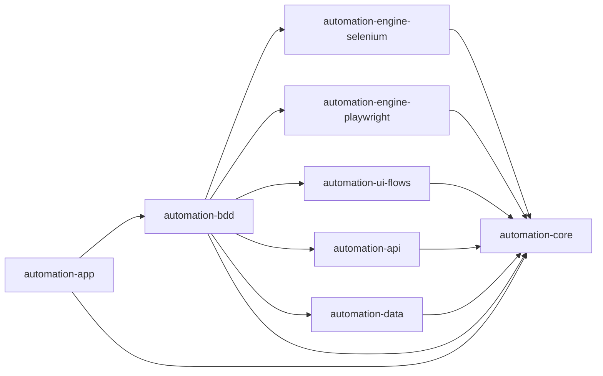

# Automation Framework Plan

## Scope

This framework is implemented as a standalone multi-module Maven project under `Automation` and does not modify frontend or backend application code.

## Module Layout

- `automation-core`
  - Shared configuration loader (`system properties > env vars > optional properties file`)
  - Environment/engine/browser models
  - Scenario/test context containers
  - Logging utility wrapper
  - Retry and polling wait utilities
  - Engine abstraction contracts
- `automation-engine-selenium`
  - Selenium `UiEngine` implementation
  - Browser factory (Chrome/Edge/Firefox, headless support)
  - Waits, element actions, screenshot service
- `automation-engine-playwright`
  - Playwright `UiEngine` implementation
  - Browser/context/page lifecycle management
  - Waits, element actions, screenshot service
- `automation-ui-flows`
  - Engine-agnostic auth page object and flow service
  - Login success and invalid login flows
  - OTP/MFA provider interfaces and implementations
  - TOTP utility support for MFA provider integration
- `automation-api`
  - RestAssured request/response specifications
  - Domain API clients (auth, profile, expenses, budgets, friends, groups, sharing, events, chat, presence)
  - Session token helper and test user data factory
- `automation-data`
  - Excel dataset reader and schema validator
  - Scenario-based row resolution with iteration and partition support
- `automation-bdd`
  - Cucumber feature files grouped by app domain
  - TestNG Cucumber runner
  - Hooks for context lifecycle and failure screenshots
  - Retry + rerun support
  - UI/API/common step definition packages
- `automation-app`
  - Main entrypoint for `--start-run` and `--run-only` orchestration
  - App bootstrap, health-check, and test launch integration

## Architecture



## Configuration Contract

Supported as system properties (`-DKEY=value`) and environment variables.

- `AUTOMATION_ENGINE=selenium|playwright`
- `TEST_ENV=local|qa|stage|prod`
- `BASE_URL`
- `API_BASE_URL`
- `BROWSER=chrome|edge|firefox`
- `HEADLESS=true|false`
- `EXPLICIT_WAIT_SEC`
- `RETRY_COUNT`
- `RERUN_FAILED_COUNT`
- `TEST_USERNAME`
- `TEST_PASSWORD`
- `AUTOMATION_RUN_ID`
- `ARTIFACTS_ROOT`
- `CAPTURE_SCREENSHOT_ALWAYS`
- `RECORD_VIDEO`
- `RECORD_TRACE`
- `DATA_WORKBOOK_PATH`
- `DATA_SHEET`
- `DATA_ITERATION`
- `DATA_PARTITION_INDEX`
- `DATA_PARTITIONS`
- `APP_START_CMD`
- `APP_STOP_CMD`
- `APP_WORKDIR`
- `APP_READY_URL`
- `APP_READY_TIMEOUT_SEC`
- `OTP_PROVIDER` (`STATIC`)
- `MFA_PROVIDER` (`STATIC|TOTP`)
- Optional provider settings:
  - `OTP_STATIC_CODE`
  - `MFA_STATIC_CODE`
  - `MFA_TOTP_SECRET`
- Parallel tuning:
  - `cucumber.thread.count` (default `1`)

## Initial Vertical Slice

- UI:
  - Login success (`@ui @smoke @requiresCredentials`)
  - Invalid login (`@ui @smoke`)
- API:
  - Signin + profile validation (`@api @smoke @requiresCredentials`)
- Skeletons:
  - OTP provider hook (`@ui @otp @regression`)
  - MFA provider hook (`@ui @mfa @regression`)

## Execution Examples

From repository root:

```bash
mvn -f Automation/pom.xml clean compile
mvn -f Automation/pom.xml test -DTEST_ENV=local -DAUTOMATION_ENGINE=selenium -Dcucumber.filter.tags="@smoke and @ui"
mvn -f Automation/pom.xml test -DTEST_ENV=local -DAUTOMATION_ENGINE=playwright -Dcucumber.filter.tags="@smoke and @ui"
mvn -f Automation/pom.xml test -DTEST_ENV=local -Dcucumber.filter.tags="@smoke and @api"
mvn -f Automation/pom.xml -pl automation-app exec:java -Dexec.args="--run-only --tags=@smoke"
```

## Reporting And Artifacts

- Cucumber reports: `automation-bdd/target/reports/cucumber`
- Allure results: `target/artifacts/<runId>/automation-bdd/reports/allure-results`
- Runtime logs: `target/artifacts/<runId>/automation-bdd/logs`
- Failure screenshots:
  - Selenium: `target/artifacts/<runId>/selenium/screenshots`
  - Playwright: `target/artifacts/<runId>/playwright/screenshots`
- Playwright video: `target/artifacts/<runId>/playwright/videos`
- Playwright trace: `target/artifacts/<runId>/playwright/traces`

## Notes

- Scenarios skip gracefully with actionable messages when services are unreachable or required credentials/providers are missing.
- Runner is configured for TestNG data provider parallel mode with default single thread, so execution is sequential by default and can be scaled with `-Dcucumber.thread.count`.
