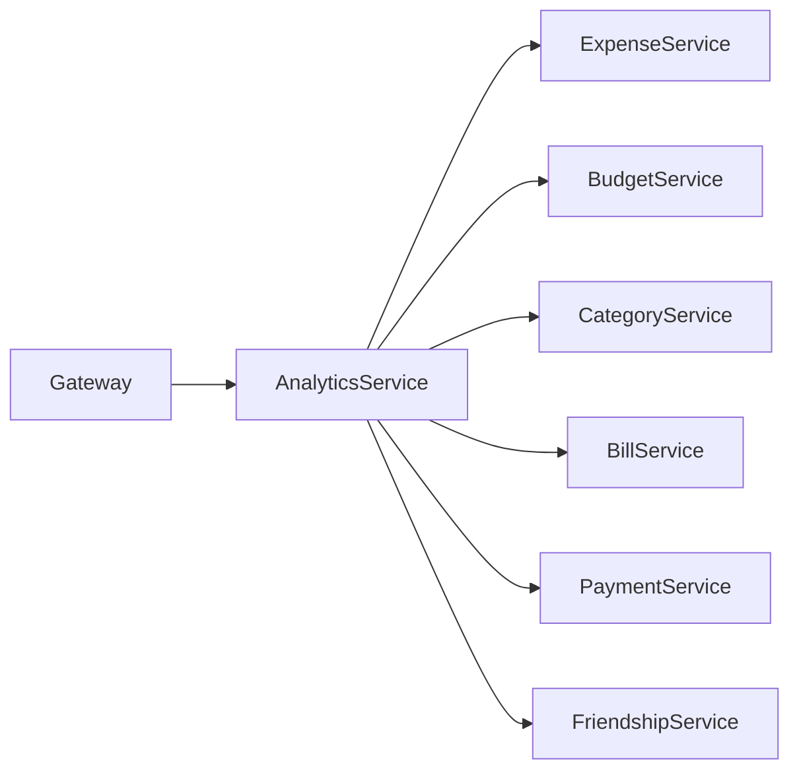
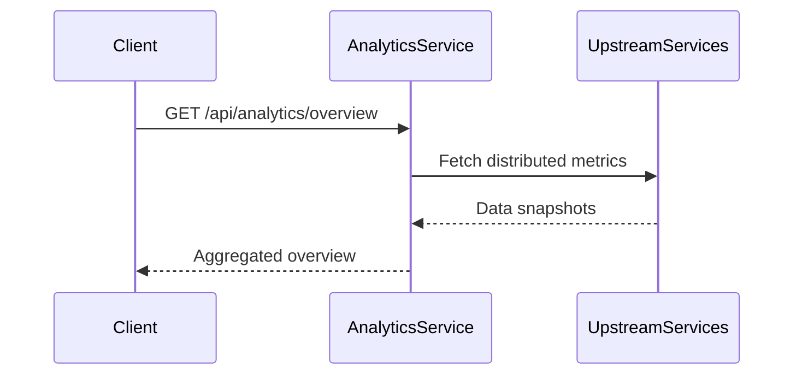
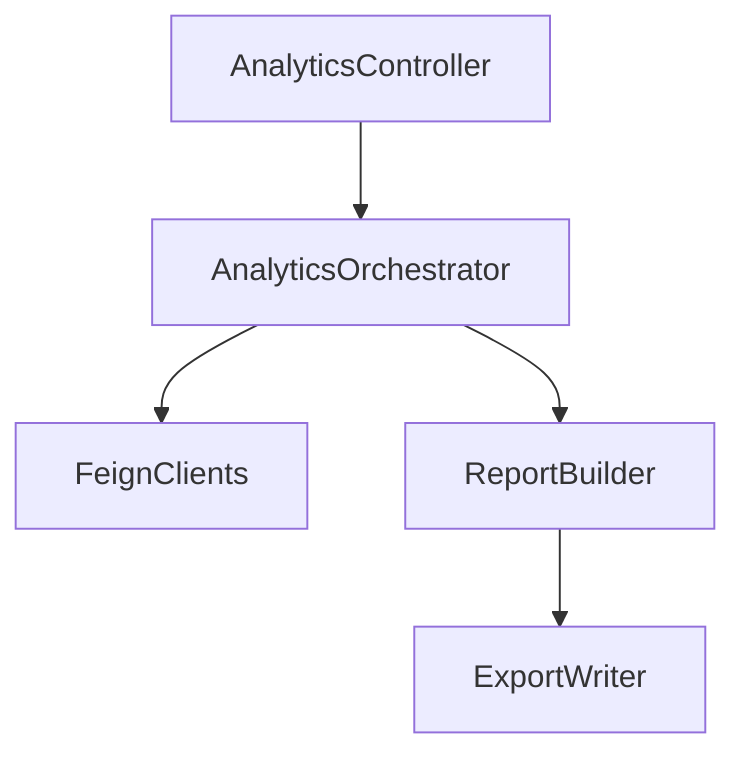

# Analytics Service

## Overview

- **Module**: `AnalyticsService`
- **Service name**: `ANALYTICS-SERVICE`
- **Default port**: `7004`
- **Responsibility**: Aggregated insights and reporting endpoints across expenses, budgets, payments, friendships, categories, and bills.

## Tech Stack and Integrations

- Spring Boot, JPA
- Eureka Client, OpenFeign

## Runtime Configuration

- **Config file**: `src/main/resources/application.yaml`
- **Port**: `server.port=7004`
- **Gateway route prefix**: `/api/analytics/**`

## API Endpoints

| Method | Path | Controller |
|--------|------|------------|
| `GET` | `/api/analytics/overview` | `AnalyticsController` |
| `POST` | `/api/analytics/entity` | `AnalyticsController` |
| `GET` | `/api/analytics/report/excel` | `AnalyticsController` |

## Integration Map

- **Consumes**: payment, friendship/group, budget, bill, category, and user services.
- **Exposes**: analytics summary and report endpoints.
- **Pattern**: read-heavy aggregation over multiple upstream services.

## Runbook

```bash
mvn spring-boot:run
```

## UML and Flow Diagrams






