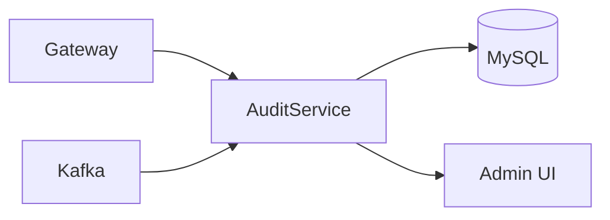
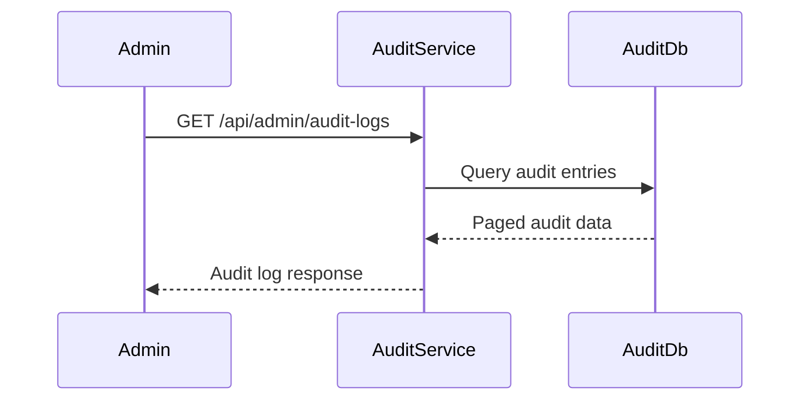
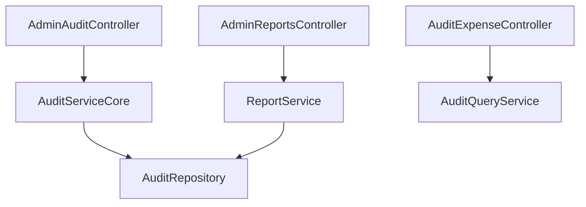

# Audit Service

## Overview

- **Module**: `Audit-Service`
- **Service name**: `AUDIT-SERVICE`
- **Default port**: `6004`
- **Responsibility**: Audit log retrieval, admin audit analytics, and report generation.

## Tech Stack and Integrations

- Spring Boot, JPA
- Kafka, Eureka Client, OpenFeign

## Runtime Configuration

- **Config file**: `src/main/resources/application.yaml`
- **Port**: `server.port=6004`
- **Gateway route prefixes**: `/api/audit-logs/**`, `/api/admin/audit-logs/**`, `/api/admin/reports/**`

## API Endpoints

| Method | Path | Controller |
|--------|------|------------|
| `GET` | `/api/audit-logs/all` | `AuditExpenseController` |
| `GET` | `/api/audit-logs/audit-types` | `AuditExpenseController` |
| `GET` | `/api/admin/audit-logs` | `AdminAuditController` |
| `GET` | `/api/admin/audit-logs/stats` | `AdminAuditController` |
| `GET` | `/api/admin/audit-logs/user/{userId}` | `AdminAuditController` |
| `GET` | `/api/admin/reports` | `AdminReportsController` |
| `POST` | `/api/admin/reports/generate` | `AdminReportsController` |
| `GET` | `/api/admin/reports/{reportId}` | `AdminReportsController` |
| `DELETE` | `/api/admin/reports/{reportId}` | `AdminReportsController` |
| `GET` | `/api/admin/reports/{reportId}/download` | `AdminReportsController` |

## Integration Map

- **Consumes**: user and expense service data where required for enriched reporting.
- **Exposes**: audit retrieval and admin reporting APIs.
- **Async**: consumes or emits `audit-events` for centralized tracking.

## Runbook

```bash
mvn spring-boot:run
```

## UML and Flow Diagrams






