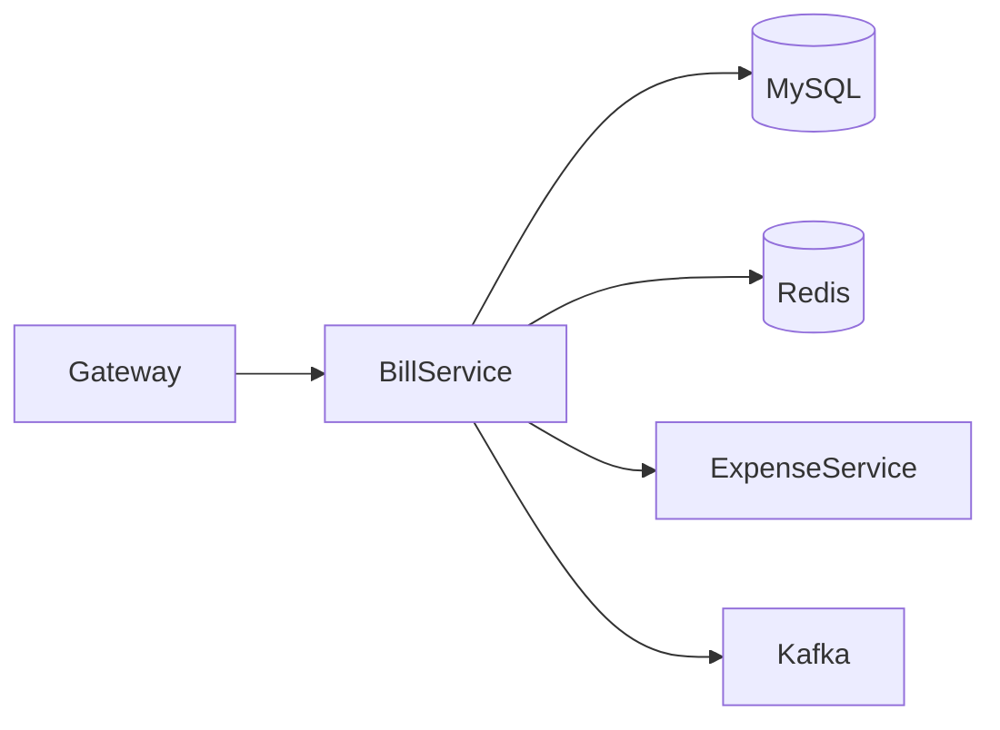
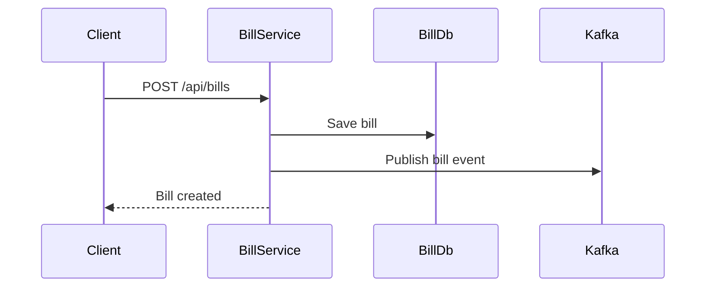
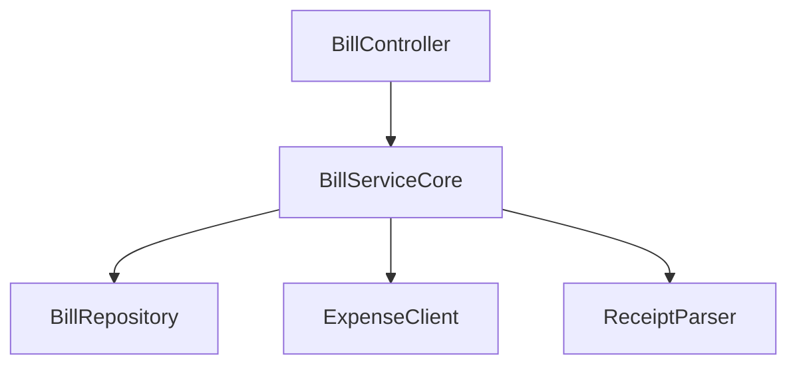

# Bill Service

## Overview

- **Module**: `Bill-Service`
- **Service name**: `BILL-SERVICE`
- **Default port**: `6007`
- **Responsibility**: Bill CRUD, bill search/export/import, and receipt processing.

## Tech Stack and Integrations

- Spring Boot, JPA, Redis
- Kafka, Eureka Client, OpenFeign
- WebSocket and OCR integration

## Runtime Configuration

- **Config file**: `src/main/resources/application.yml`
- **Port**: `server.port=6007`
- **Gateway route prefix**: `/api/bills/**`

## API Endpoints

| Method | Path | Controller |
|--------|------|------------|
| `POST` | `/api/bills` | `BillController` |
| `POST` | `/api/bills/add-multiple` | `BillController` |
| `GET` | `/api/bills/{id}` | `BillController` |
| `PUT` | `/api/bills/{id}` | `BillController` |
| `DELETE` | `/api/bills/{id}` | `BillController` |
| `GET` | `/api/bills` | `BillController` |
| `GET` | `/api/bills/search` | `BillController` |
| `GET` | `/api/bills/export/excel` | `BillController` |
| `POST` | `/api/bills/import/excel/save` | `BillController` |
| `POST` | `/api/bills/scan-receipt` | `BillController` |

## Integration Map

- **Consumes**: expense service and friendship service.
- **Exposes**: bill data for expense and analytics modules.
- **Async**: bill event publishing to Kafka.

## Runbook

```bash
mvn spring-boot:run
```

## UML and Flow Diagrams






