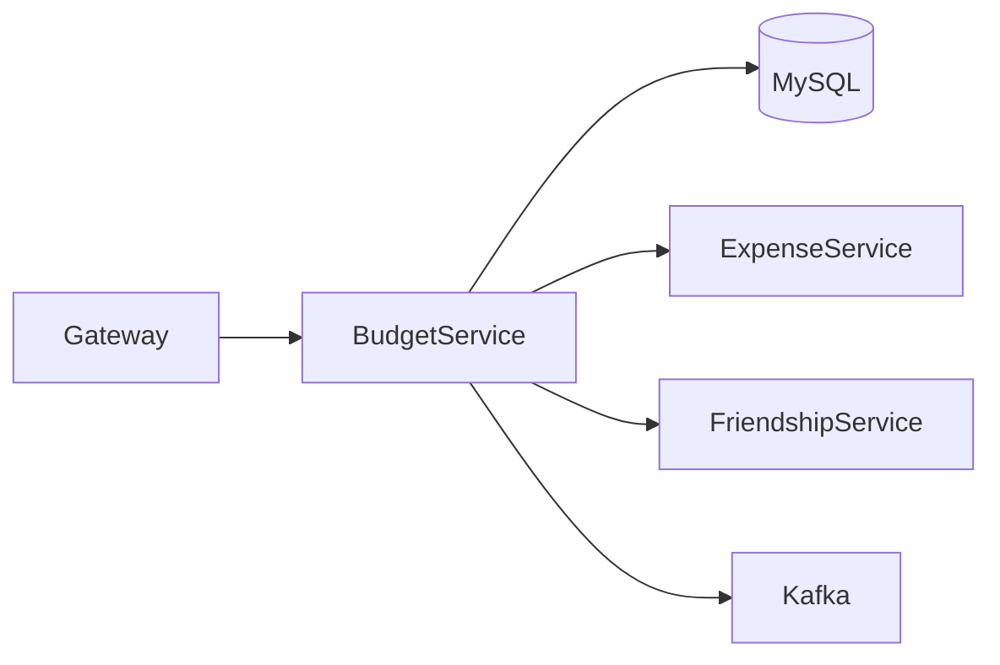
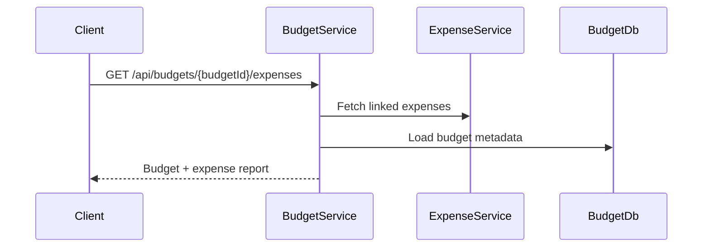
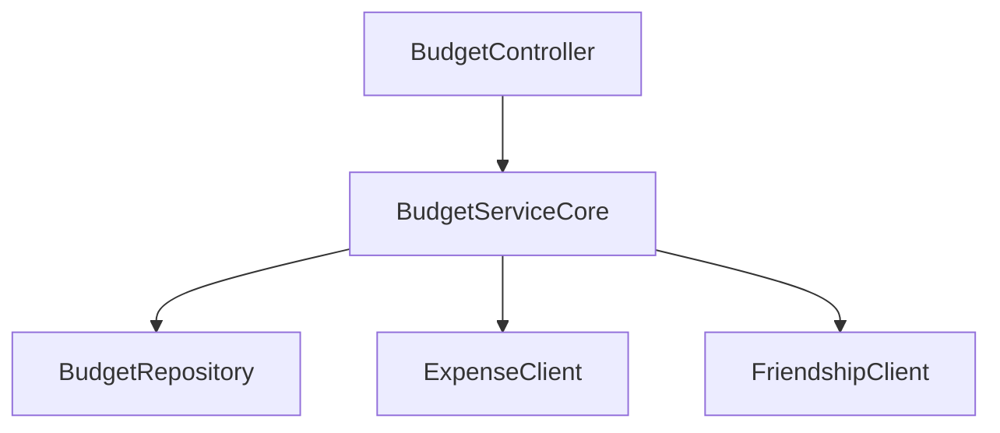

# Budget Service

## Overview

- **Module**: `Budget-Service`
- **Service name**: `BUDGET-SERVICE`
- **Default port**: `6005`
- **Responsibility**: Budget planning, budget lifecycle management, budget reports, and expense-to-budget analysis.

## Tech Stack and Integrations

- Spring Boot, JPA
- Kafka, Eureka Client, OpenFeign

## Runtime Configuration

- **Config file**: `src/main/resources/application.yaml`
- **Port**: `server.port=6005`
- **Gateway route prefix**: `/api/budgets/**`

## API Endpoints

| Method | Path | Controller |
|--------|------|------------|
| `POST` | `/api/budgets` | `BudgetController` |
| `PUT` | `/api/budgets/{budgetId}` | `BudgetController` |
| `DELETE` | `/api/budgets/{budgetId}` | `BudgetController` |
| `GET` | `/api/budgets/{budgetId}` | `BudgetController` |
| `GET` | `/api/budgets` | `BudgetController` |
| `GET` | `/api/budgets/{budgetId}/expenses` | `BudgetController` |
| `GET` | `/api/budgets/report/{budgetId}` | `BudgetController` |
| `GET` | `/api/budgets/reports` | `BudgetController` |
| `GET` | `/api/budgets/detailed-report/{budgetId}` | `BudgetController` |
| `GET` | `/api/budgets/search` | `BudgetController` |

## Integration Map

- **Consumes**: expense service and friendship service via Feign.
- **Exposes**: budget data consumed by analytics and search.
- **Async**: budget event publishing for story/notification flows.

## Runbook

```bash
mvn spring-boot:run
```

## UML and Flow Diagrams






