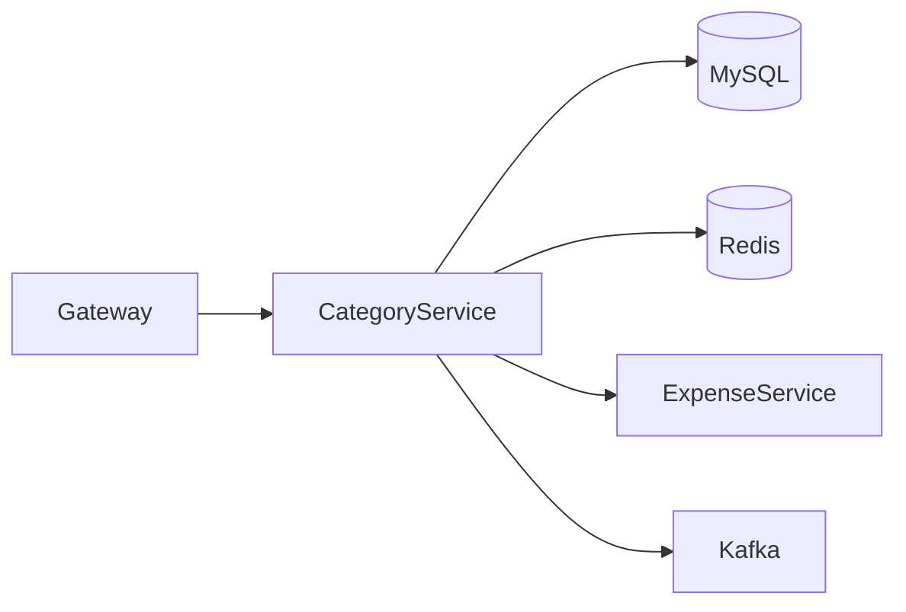
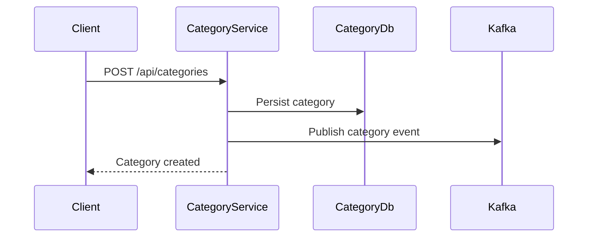
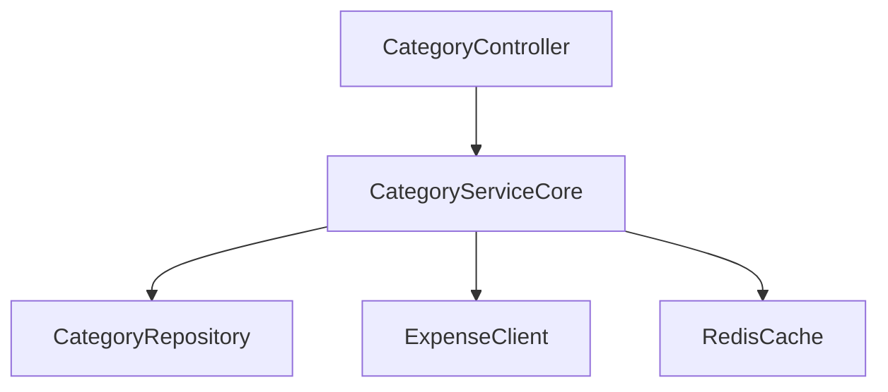

# Category Service

## Overview

- **Module**: `Category-Service`
- **Service name**: `CATEGORY-SERVICE`
- **Default port**: `6008`
- **Responsibility**: Category management and category-expense relationship operations.

## Tech Stack and Integrations

- Spring Boot, JPA, Redis cache
- Kafka, Eureka Client, OpenFeign
- WebSocket support

## Runtime Configuration

- **Config file**: `src/main/resources/application.yml`
- **Port**: `server.port=6008`
- **Gateway route prefix**: `/api/categories/**`

## API Endpoints

| Method | Path | Controller |
|--------|------|------------|
| `POST` | `/api/categories` | `CategoryController` |
| `GET` | `/api/categories/{id}` | `CategoryController` |
| `GET` | `/api/categories` | `CategoryController` |
| `PUT` | `/api/categories/{id}` | `CategoryController` |
| `DELETE` | `/api/categories/{id}` | `CategoryController` |
| `POST` | `/api/categories/bulk` | `CategoryController` |
| `GET` | `/api/categories/name/{name}` | `CategoryController` |
| `GET` | `/api/categories/search` | `CategoryController` |
| `GET` | `/api/categories/{categoryId}/expenses` | `CategoryController` |
| `GET` | `/api/categories/uncategorized` | `CategoryController` |

## Integration Map

- **Consumes**: expense and friendship services.
- **Exposes**: category lookup and category metadata for expense and analytics flows.
- **Async**: category and category-expense events for notifications.

## Runbook

```bash
mvn spring-boot:run
```

## UML and Flow Diagrams






