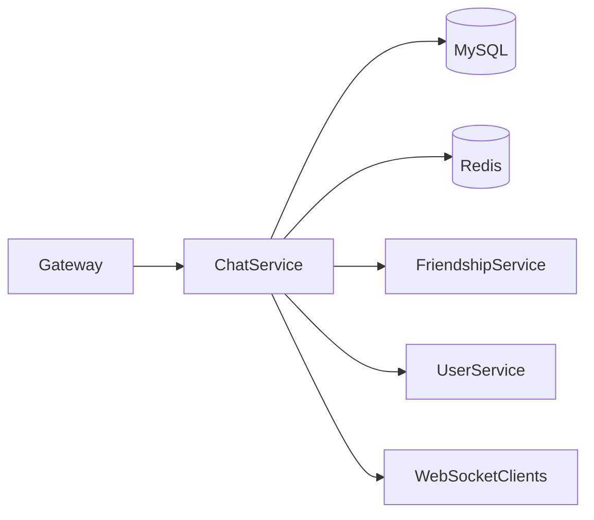
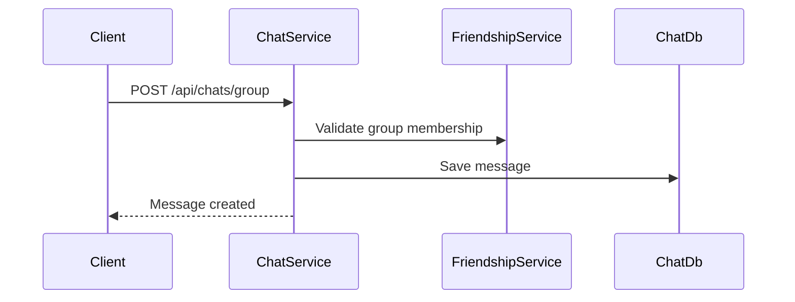
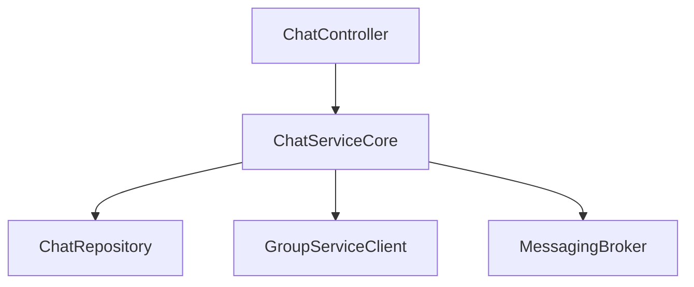

# Chat Service

## Overview

- **Module**: `Chat-Service`
- **Service name**: `CHAT-SERVICE`
- **Default port**: `7001`
- **Responsibility**: One-to-one and group chat APIs, chat history, unread status, and presence messaging.

## Tech Stack and Integrations

- Spring Boot, JPA, Redis
- Eureka Client, OpenFeign
- WebSocket/STOMP messaging

## Runtime Configuration

- **Config file**: `src/main/resources/application.yml`
- **Port**: `server.port=7001`
- **Gateway route prefixes**: `/api/chats/**`, `/chat/**`

## API Endpoints

| Method | Path | Controller |
|--------|------|------------|
| `POST` | `/api/chats/one-to-one` | `ChatController` |
| `POST` | `/api/chats/group` | `ChatController` |
| `GET` | `/api/chats/user` | `ChatController` |
| `GET` | `/api/chats` | `ChatController` |
| `GET` | `/api/chats/history/user/{userId}` | `ChatController` |
| `GET` | `/api/chats/history/group/{groupId}` | `ChatController` |
| `PUT` | `/api/chats/{chatId}/read` | `ChatController` |
| `DELETE` | `/api/chats/{id}` | `ChatController` |
| `GET` | `/api/chats/unread/count` | `ChatController` |
| `GET` | `/api/chats/conversations` | `ChatController` |

## Integration Map

- **Consumes**: friendship/group and user service data for membership and identity checks.
- **Exposes**: chat and conversation APIs for frontend clients.
- **Async/realtime**: WebSocket channels for message push and typing/presence updates.

## Runbook

```bash
mvn spring-boot:run
```

## UML and Flow Diagrams






