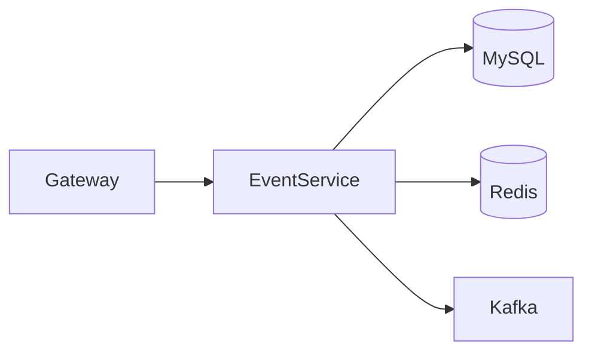
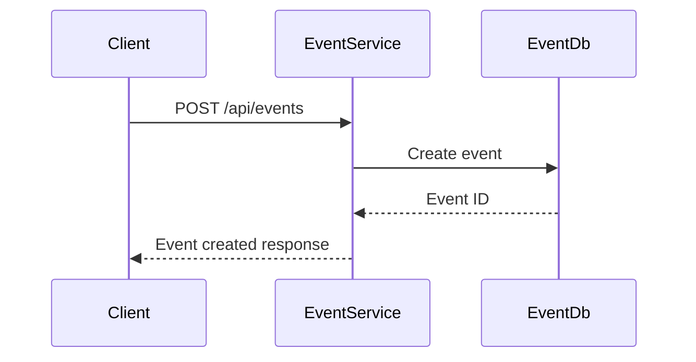
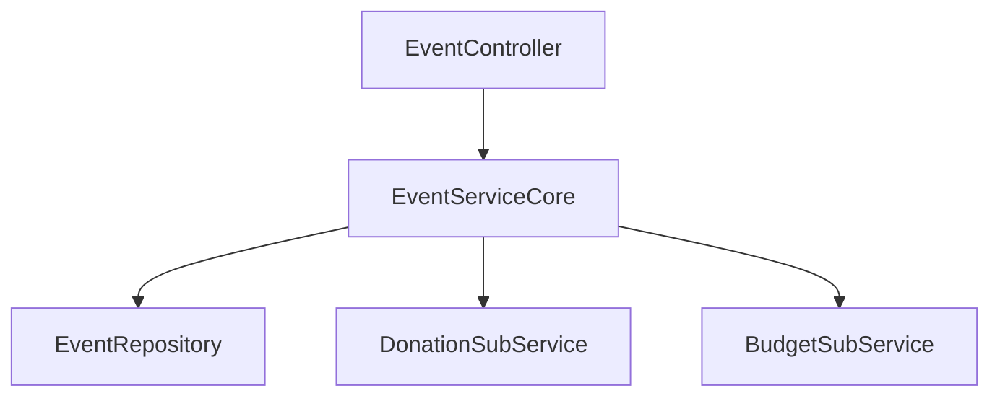

# Event Service

## Overview

- **Module**: `Event-Service`
- **Service name**: `EVENT-SERVICE`
- **Default port**: `7002`
- **Responsibility**: Event planning, participant management, event expenses/donations, and event-level budget tracking.

## Tech Stack and Integrations

- Spring Boot, JPA, Redis
- Kafka, Eureka Client
- WebSocket support

## Runtime Configuration

- **Config file**: `src/main/resources/application.yml`
- **Port**: `server.port=7002`
- **Gateway route prefix**: `/api/events/**`

## API Endpoints

| Method | Path | Controller |
|--------|------|------------|
| `POST` | `/api/events` | `EventController` |
| `PUT` | `/api/events/{eventId}/user/{userId}` | `EventController` |
| `DELETE` | `/api/events/{eventId}/user/{userId}` | `EventController` |
| `GET` | `/api/events/{eventId}/user/{userId}` | `EventController` |
| `GET` | `/api/events/user/{userId}` | `EventController` |
| `POST` | `/api/events/expenses` | `EventController` |
| `GET` | `/api/events/{eventId}/expenses/user/{userId}` | `EventController` |
| `GET` | `/api/events/{eventId}/summary/user/{userId}` | `EventController` |
| `POST` | `/api/events/donations` | `EventController` |
| `POST` | `/api/events/budgets` | `EventController` |

## Integration Map

- **Consumes**: internal event-related service components and shared library contracts.
- **Exposes**: event lifecycle and event finance APIs.
- **Async**: Kafka-based event activity publishing/consumption.

## Runbook

```bash
mvn spring-boot:run
```

## UML and Flow Diagrams






