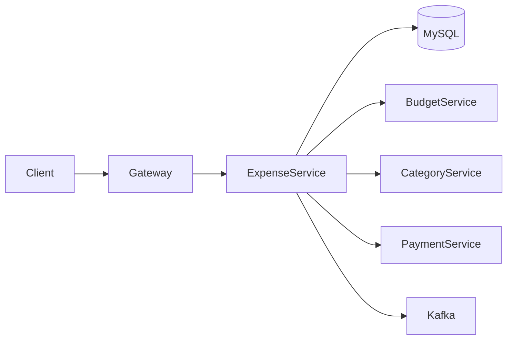
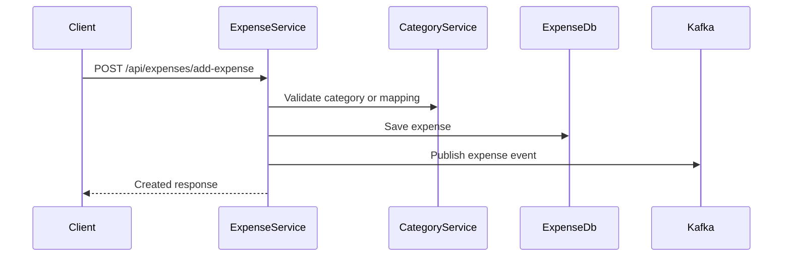
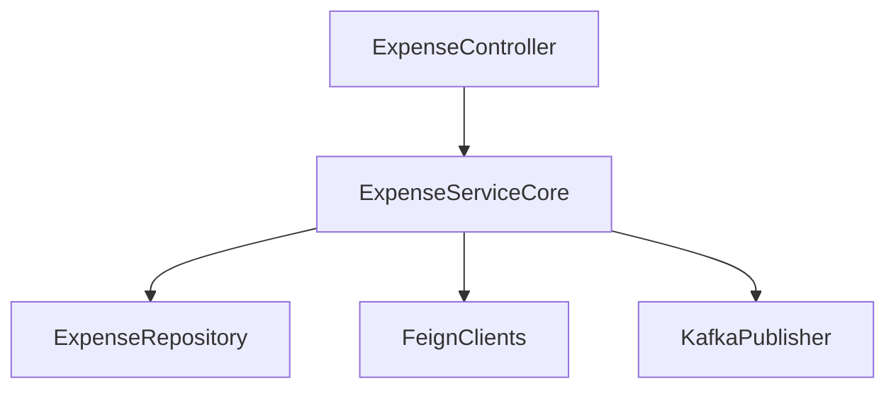

# Expense Service

## Overview

- **Module**: `Expense-Service`
- **Service name**: `EXPENSE-TRACKING-SYSTEM`
- **Default port**: `6000`
- **Responsibility**: Expense CRUD, summaries, cashflow, imports/bulk processing, and expense settings.

## Tech Stack and Integrations

- Spring Boot, JPA, OpenAPI
- Eureka Client, OpenFeign, Kafka
- WebSocket and Mail integrations

## Runtime Configuration

- **Config file**: `src/main/resources/application.yml`
- **Port**: `server.port=6000`
- **Gateway route prefixes**: `/api/expenses/**`, `/api/settings/**`, `/daily-summary/**`, `/api/investment/**`, `/api/bulk/**`

## API Endpoints

| Method | Path | Controller |
|--------|------|------------|
| `POST` | `/api/expenses/add-expense` | `ExpenseController` |
| `POST` | `/api/expenses/add-multiple` | `ExpenseController` |
| `GET` | `/api/expenses/expense/{id}` | `ExpenseController` |
| `GET` | `/api/expenses/fetch-expenses` | `ExpenseController` |
| `GET` | `/api/expenses/fetch-expenses-paginated` | `ExpenseController` |
| `PUT` | `/api/expenses/edit-expense/{id}` | `ExpenseController` |
| `DELETE` | `/api/expenses/delete/{id}` | `ExpenseController` |
| `GET` | `/api/expenses/search` | `ExpenseController` |
| `GET` | `/api/expenses/summary-expenses` | `ExpenseController` |
| `GET` | `/api/expenses/cashflow` | `ExpenseController` |

## Integration Map

- **Consumes**: bill, payment, friendship, category, budget services via Feign clients.
- **Exposes**: expense data used by budget, notification, analytics, and search services.
- **Async**: publishes expense-related Kafka events.

## Runbook

```bash
mvn spring-boot:run
```

## UML and Flow Diagrams

### Service context



### Add expense sequence



### Internal view


