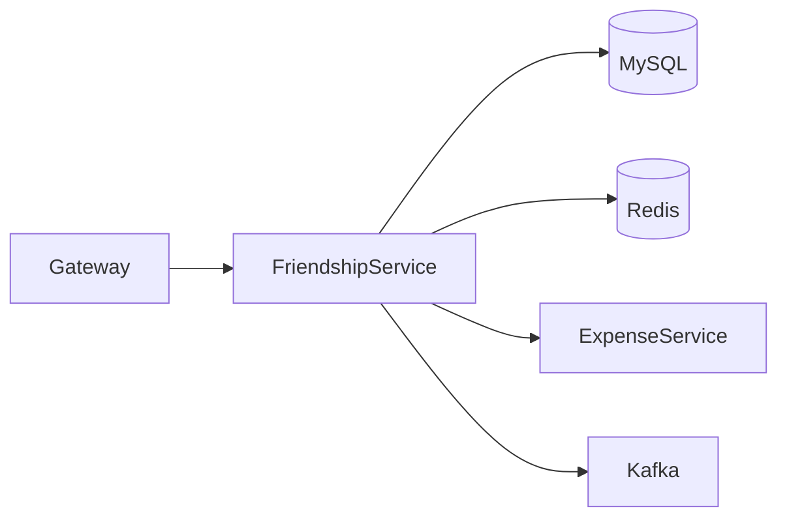
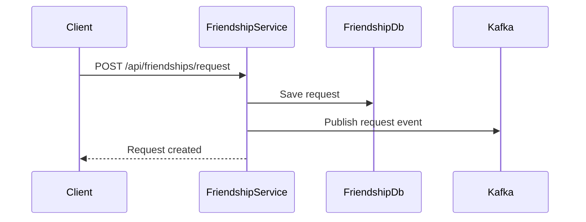
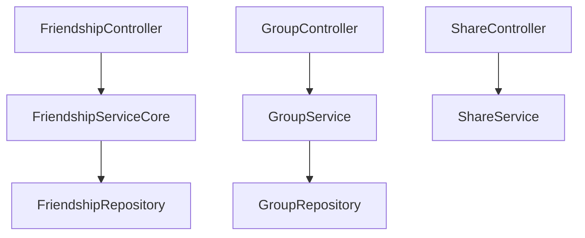

# Friendship Service

## Overview

- **Module**: `FriendShip-Service`
- **Service name**: `FRIENDSHIP-SERVICE`
- **Default port**: `6009`
- **Responsibility**: Friend requests, group operations, activity sharing, and access-control checks for collaborative features.

## Tech Stack and Integrations

- Spring Boot, JPA, Redis
- Kafka, Eureka Client, OpenFeign
- WebSocket and QR support

## Runtime Configuration

- **Config file**: `src/main/resources/application.yml`
- **Port**: `server.port=6009`
- **Gateway route prefixes**: `/api/friendships/**`, `/api/groups/**`, `/api/activities/**`, `/api/shares/**`

## API Endpoints

| Method | Path | Controller |
|--------|------|------------|
| `POST` | `/api/friendships/request` | `FriendshipController` |
| `PUT` | `/api/friendships/{friendshipId}/respond` | `FriendshipController` |
| `GET` | `/api/friendships/friends` | `FriendshipController` |
| `GET` | `/api/friendships/pending` | `FriendshipController` |
| `DELETE` | `/api/friendships/{friendshipId}` | `FriendshipController` |
| `GET` | `/api/friendships/can-access-expenses` | `FriendshipController` |
| `GET` | `/api/friendships/can-modify-expenses` | `FriendshipController` |
| `GET` | `/api/groups` | `GroupController` |
| `POST` | `/api/groups` | `GroupController` |
| `GET` | `/api/shares/my-shares` | `ShareController` |

## Integration Map

- **Consumes**: expense service for access-aware expense operations.
- **Exposes**: friendship and group data used by chat, payment, category, budget, and analytics services.
- **Async**: friendship and activity events to Kafka.

## Runbook

```bash
mvn spring-boot:run
```

## UML and Flow Diagrams






