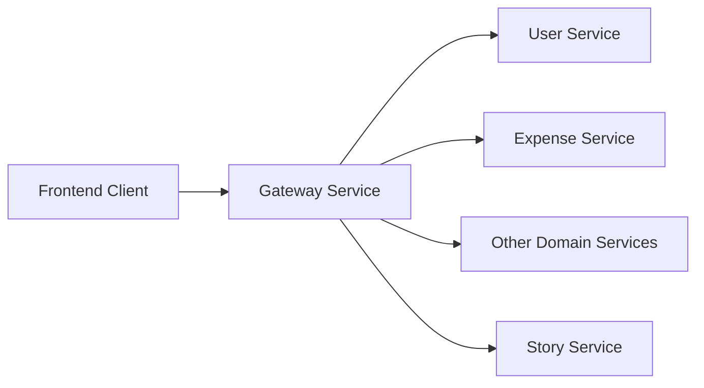
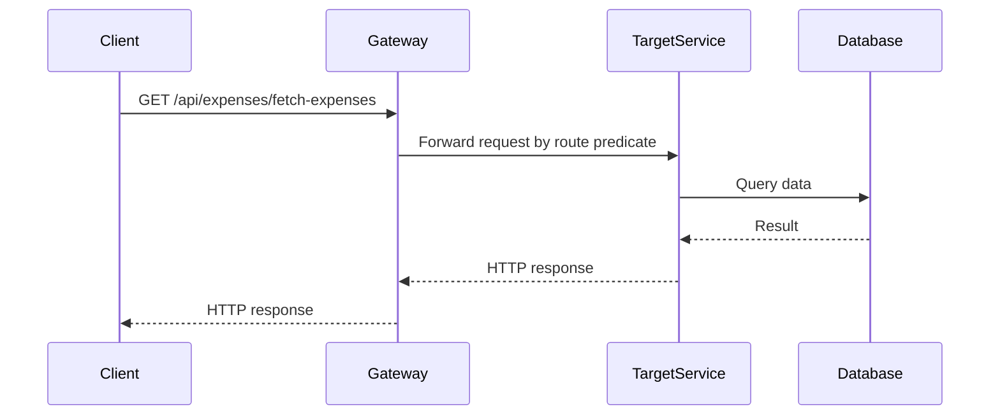
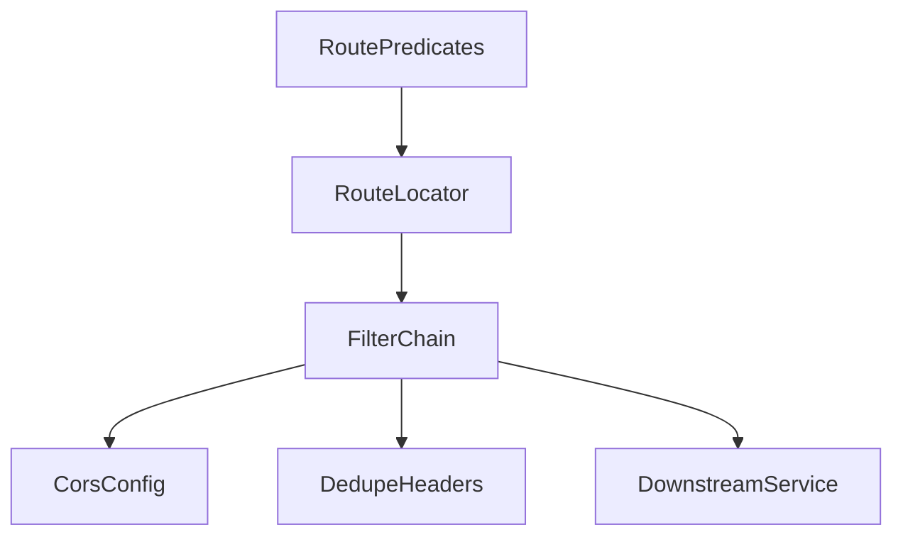

# Gateway Service

## Overview

- **Module**: `Gateway`
- **Service name**: `GATEWAY-SERVICE`
- **Default port**: `8080`
- **Type**: Infrastructure service (API gateway)
- **Responsibility**: Single entry point for frontend and external clients, with path-based routing to backend microservices.

## Responsibilities

- Route incoming requests to the correct microservice using Spring Cloud Gateway predicates.
- Apply global CORS and response header deduplication filters.
- Integrate with Eureka for dynamic discovery and with env-based fallback URLs.

## Tech Stack and Dependencies

- Spring Boot 3.x
- Spring Cloud Gateway
- Eureka Client + LoadBalancer
- Common shared library (`expense-common-library`)

## Runtime Configuration

- **Config file**: `src/main/resources/application.yaml`
- **Port**: `server.port=8080`
- **Eureka**: `eureka.client.serviceUrl.defaultZone=http://localhost:8761/eureka`
- **Route target env vars**:
  - `USER_SERVICE_URL`
  - `EXPENSE_TRACKING_SERVICE_URL`
  - `BUDGET_SERVICE_URL`
  - `CATEGORY_SERVICE_URL`
  - `BILL_SERVICE_URL`
  - `PAYMENT_SERVICE_URL`
  - `FRIENDSHIP_SERVICE_URL`
  - `NOTIFICATION_SERVICE_URL`
  - `CHAT_SERVICE_URL`
  - `AUDIT_SERVICE_URL`
  - `ANALYTICS_SERVICE_URL`
  - `SEARCH_SERVICE_URL`
  - `STORY_SERVICE_URL`
  - `EVENT_SERVICE_URL`

## API Routing Surface

| Route ID | Path Prefixes | Default Target |
|----------|---------------|----------------|
| `USER-SERVICE` | `/auth/**`, `/api/user/**`, `/api/admin/**`, `/api/roles/**`, `/api/permissions/**` | `http://localhost:6001` |
| `EXPENSE-TRACKING-SYSTEM` | `/api/expenses/**`, `/api/settings/**`, `/daily-summary/**`, `/api/investment/**`, `/api/bulk/**` | `http://localhost:6000` |
| `BUDGET-SERVICE` | `/api/budgets/**` | `http://localhost:6005` |
| `CATEGORY-SERVICE` | `/api/categories/**` | `http://localhost:6008` |
| `BILL-SERVICE` | `/api/bills/**` | `http://localhost:6007` |
| `PAYMENT-SERVICE` | `/api/payment-methods/**` | `http://localhost:6006` |
| `FRIENDSHIP-SERVICE` | `/api/friendships/**`, `/api/groups/**`, `/api/activities/**`, `/api/shares/**` | `http://localhost:6009` |
| `NOTIFICATION-SERVICE` | `/api/notifications/**`, `/api/notification-preferences/**` | `http://localhost:6003` |
| `CHAT-SERVICE` | `/api/chats/**`, `/chat/**` | `http://localhost:7001` |
| `AUDIT-SERVICE` | `/api/audit-logs/**`, `/api/admin/audit-logs/**`, `/api/admin/reports/**` | `http://localhost:6004` |
| `ANALYTICS-SERVICE` | `/api/analytics/**` | `http://localhost:7004` |
| `SEARCH-SERVICE` | `/api/search/**`, `/api/shortcuts/**` | `http://localhost:7005` |
| `STORY-SERVICE` | `/api/stories/**`, `/api/admin/stories/**`, `/ws-stories/**` | `http://localhost:6010` |
| `EVENT-SERVICE` | `/api/events/**` | `http://localhost:7002` |

## Runbook

### Local run

```bash
mvn spring-boot:run
```

### Build

```bash
mvn clean install
```

## UML and Flow Diagrams

### Service context



### Request sequence



### Internal component view


