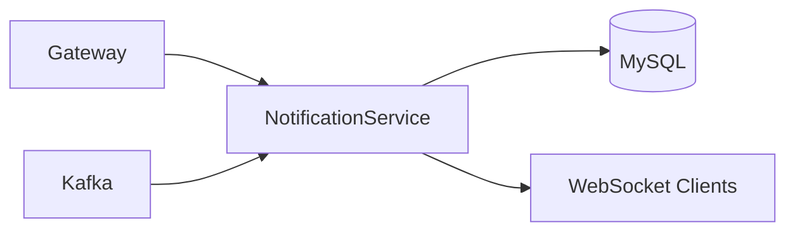
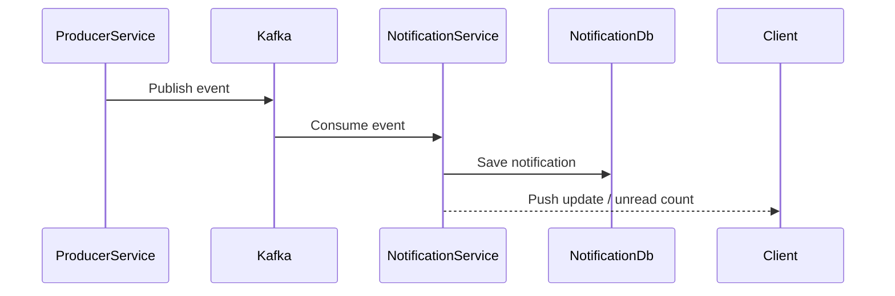
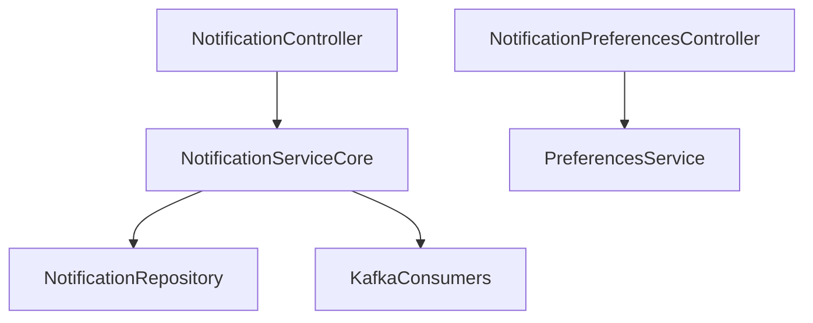

# Notification Service

## Overview

- **Module**: `Notification-Service`
- **Service name**: `NOTIFICATION-SERVICE`
- **Default port**: `6003`
- **Responsibility**: User notifications, notification preferences, unread counters, and event-driven notification delivery.

## Tech Stack and Integrations

- Spring Boot, JPA
- Kafka, Eureka Client, OpenFeign
- WebSocket for near real-time updates

## Runtime Configuration

- **Config file**: `src/main/resources/application.yaml`
- **Port**: `server.port=6003`
- **Gateway route prefixes**: `/api/notifications/**`, `/api/notification-preferences/**`

## API Endpoints

| Method | Path | Controller |
|--------|------|------------|
| `GET` | `/api/notifications` | `NotificationController` |
| `GET` | `/api/notifications/unread` | `NotificationController` |
| `GET` | `/api/notifications/count/unread` | `NotificationController` |
| `PUT` | `/api/notifications/{notificationId}/read` | `NotificationController` |
| `PUT` | `/api/notifications/read-all` | `NotificationController` |
| `DELETE` | `/api/notifications/{notificationId}` | `NotificationController` |
| `GET` | `/api/notifications/preferences` | `NotificationController` |
| `PUT` | `/api/notifications/preferences` | `NotificationController` |
| `GET` | `/api/notification-preferences` | `NotificationPreferencesController` |
| `PUT` | `/api/notification-preferences` | `NotificationPreferencesController` |

## Integration Map

- **Consumes**: task/expense-related service events and REST lookups.
- **Exposes**: notification APIs used by frontend.
- **Async**: consumes multiple Kafka topics and persists generated notifications.

## Runbook

```bash
mvn spring-boot:run
```

## UML and Flow Diagrams






