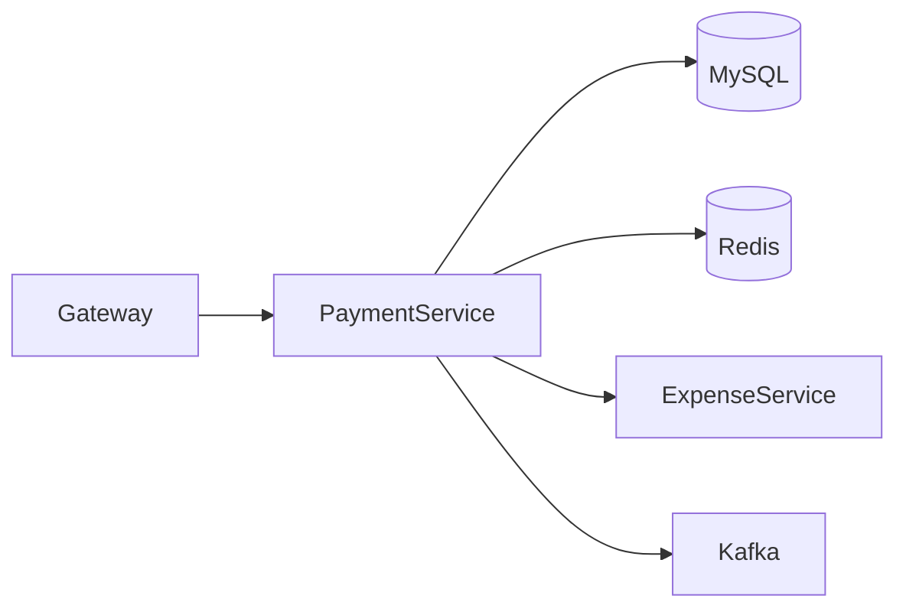
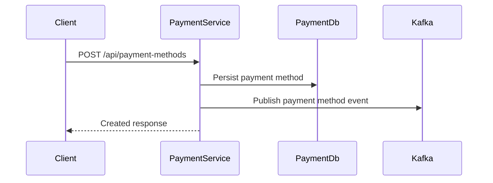
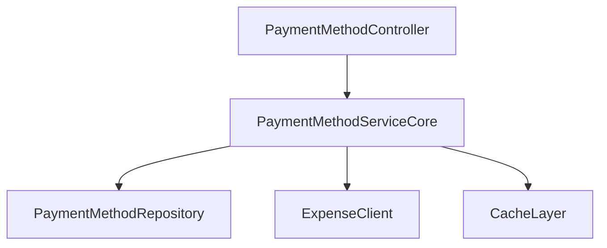

# Payment Method Service

## Overview

- **Module**: `Payment-method-Service`
- **Service name**: `PAYMENT-SERVICE`
- **Default port**: `6006`
- **Responsibility**: Payment method CRUD, search, and payment method usage validation.

## Tech Stack and Integrations

- Spring Boot, JPA, Redis
- Kafka, Eureka Client, OpenFeign
- WebSocket support

## Runtime Configuration

- **Config file**: `src/main/resources/application.yml`
- **Port**: `server.port=6006`
- **Gateway route prefix**: `/api/payment-methods/**`

## API Endpoints

| Method | Path | Controller |
|--------|------|------------|
| `GET` | `/api/payment-methods/{id}` | `PaymentMethodController` |
| `GET` | `/api/payment-methods` | `PaymentMethodController` |
| `POST` | `/api/payment-methods` | `PaymentMethodController` |
| `PUT` | `/api/payment-methods/{id}` | `PaymentMethodController` |
| `DELETE` | `/api/payment-methods/{id}` | `PaymentMethodController` |
| `GET` | `/api/payment-methods/name-and-type` | `PaymentMethodController` |
| `POST` | `/api/payment-methods/save` | `PaymentMethodController` |
| `GET` | `/api/payment-methods/search` | `PaymentMethodController` |
| `GET` | `/api/payment-methods/unused` | `PaymentMethodController` |
| `DELETE` | `/api/payment-methods/all` | `PaymentMethodController` |

## Integration Map

- **Consumes**: expense service and friendship service.
- **Exposes**: payment metadata used by expense and analytics services.
- **Async**: payment method activity events to Kafka.

## Runbook

```bash
mvn spring-boot:run
```

## UML and Flow Diagrams






