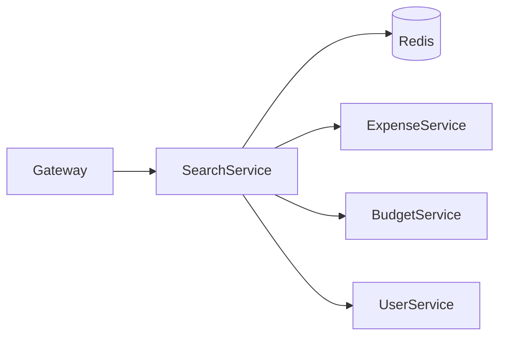
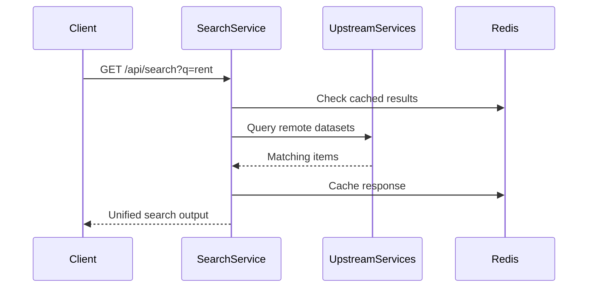
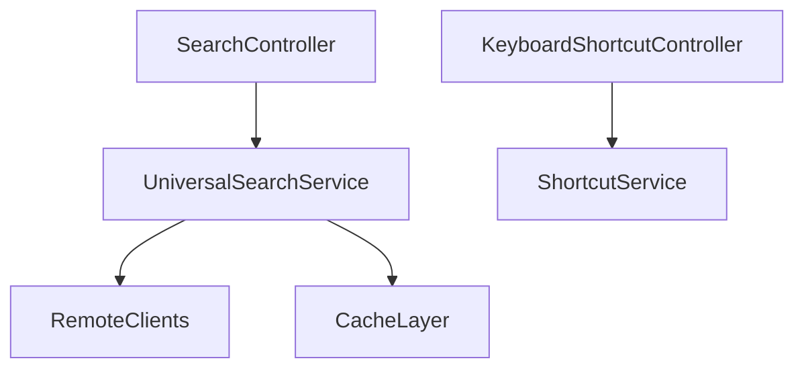

# Search Service

## Overview

- **Module**: `Search-Service`
- **Service name**: `SEARCH-SERVICE`
- **Default port**: `7005`
- **Responsibility**: Unified cross-entity search and keyboard shortcut recommendation APIs.

## Tech Stack and Integrations

- Spring Boot, WebFlux, JPA
- Eureka Client, Redis cache
- WebClient/Feign style remote integrations

## Runtime Configuration

- **Config file**: `src/main/resources/application.yaml`
- **Port**: `server.port=7005` (or `SERVER_PORT`)
- **Gateway route prefixes**: `/api/search/**`, `/api/shortcuts/**`

## API Endpoints

| Method | Path | Controller |
|--------|------|------------|
| `GET` | `/api/search` | `SearchController` |
| `GET` | `/api/search/health` | `SearchController` |
| `GET` | `/api/shortcuts` | `KeyboardShortcutController` |
| `POST` | `/api/shortcuts/update` | `KeyboardShortcutController` |
| `GET` | `/api/shortcuts/recommendations` | `KeyboardShortcutController` |
| `POST` | `/api/shortcuts/reset` | `KeyboardShortcutController` |
| `POST` | `/api/shortcuts/track` | `KeyboardShortcutController` |
| `POST` | `/api/shortcuts/recommendations/{actionId}/accept` | `KeyboardShortcutController` |
| `POST` | `/api/shortcuts/recommendations/{actionId}/reject` | `KeyboardShortcutController` |

## Integration Map

- **Consumes**: expense, budget, category, bill, payment, friendship, and user service data.
- **Exposes**: unified search and user productivity shortcuts endpoints.
- **Caching**: redis-backed acceleration for frequent search paths.

## Runbook

```bash
mvn spring-boot:run
```

## UML and Flow Diagrams






