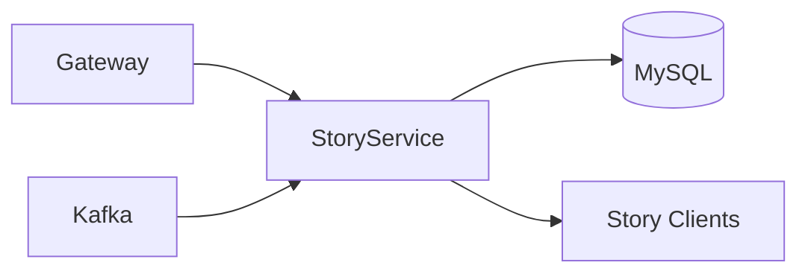
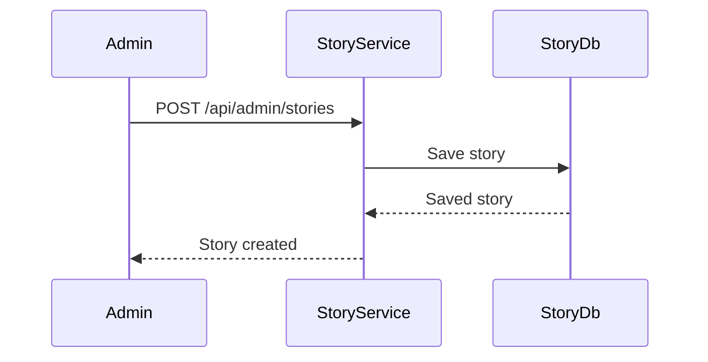
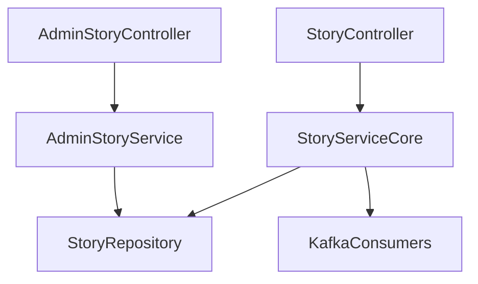

# Story Service

## Overview

- **Module**: `Story-Service`
- **Service name**: `STORY-SERVICE`
- **Default port**: `6010`
- **Responsibility**: Story feed generation and admin story lifecycle management.

## Tech Stack and Integrations

- Spring Boot, JPA
- Kafka, Eureka Client
- WebSocket support for story updates

## Runtime Configuration

- **Config file**: `src/main/resources/application.yaml`
- **Port**: `server.port=6010`
- **Gateway route prefixes**: `/api/stories/**`, `/api/admin/stories/**`, `/ws-stories/**`

## API Endpoints

| Method | Path | Controller |
|--------|------|------------|
| `GET` | `/api/stories` | `StoryController` |
| `GET` | `/api/stories/{storyId}` | `StoryController` |
| `POST` | `/api/stories/{storyId}/seen` | `StoryController` |
| `POST` | `/api/stories/{storyId}/dismiss` | `StoryController` |
| `POST` | `/api/admin/stories` | `AdminStoryController` |
| `PUT` | `/api/admin/stories/{storyId}` | `AdminStoryController` |
| `DELETE` | `/api/admin/stories/{storyId}` | `AdminStoryController` |
| `GET` | `/api/admin/stories` | `AdminStoryController` |
| `POST` | `/api/admin/stories/{storyId}/activate` | `AdminStoryController` |
| `POST` | `/api/admin/stories/{storyId}/archive` | `AdminStoryController` |

## Integration Map

- **Consumes**: Kafka budget/expense activity topics for story generation.
- **Exposes**: user and admin story APIs.
- **Realtime**: web socket endpoint for live story updates.

## Runbook

```bash
mvn spring-boot:run
```

## UML and Flow Diagrams






