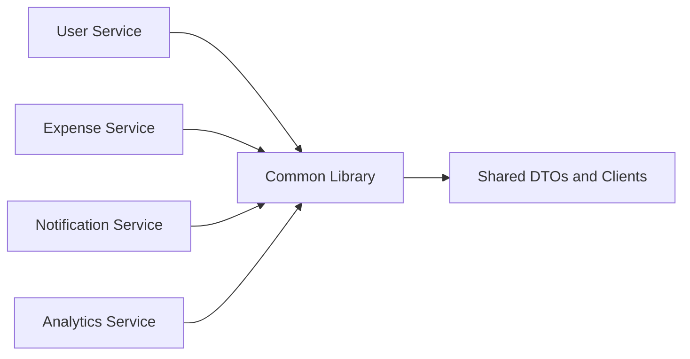
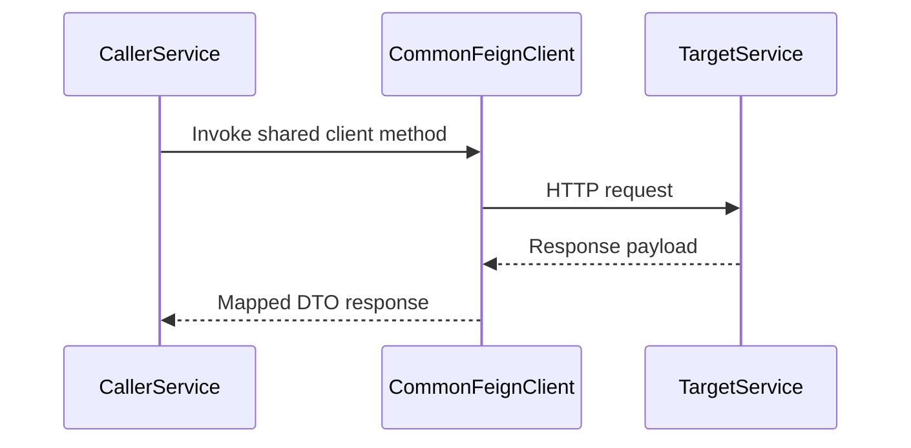
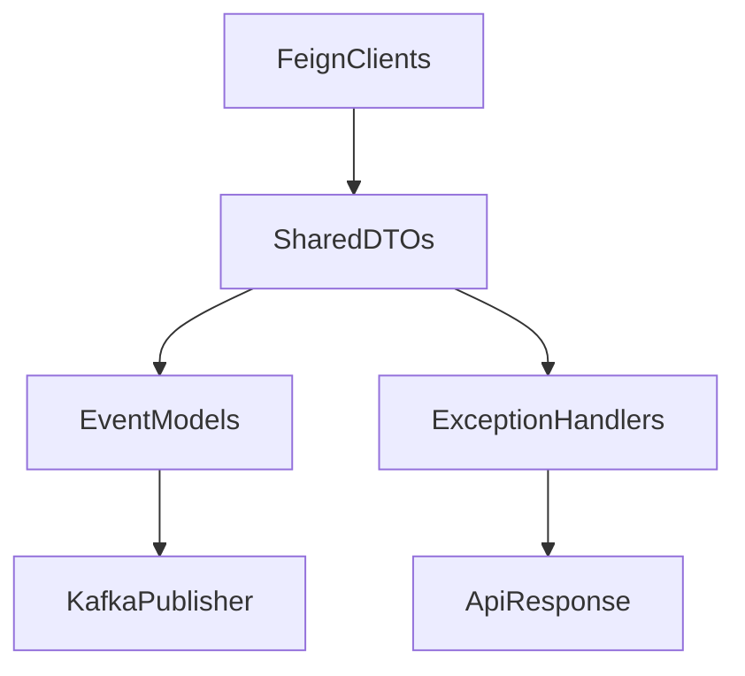

# Common Library

## Overview

- **Module**: `common-library`
- **Artifact**: `expense-common-library`
- **Type**: Shared library
- **Responsibility**: Reusable components across all services (Feign clients, Kafka helpers, common configs, shared DTOs/events/exceptions).

## Responsibilities

- Provide standardized cross-cutting utilities and shared contracts.
- Centralize common Feign clients for service-to-service communication.
- Provide common Kafka/event abstractions and default topic config.

## Tech Stack and Dependencies

- Spring Boot common starters (as library dependencies)
- OpenFeign
- Spring Kafka
- Security/JWT helpers
- Shared validation, exception, and response utilities

## Runtime Configuration

- **Config file**: `src/main/resources/common-library-defaults.yml`
- **Feature toggles**:
  - `common-library.exception-handling.enabled`
  - `common-library.security.enabled`
  - `common-library.jwt.enabled`
  - `common-library.feign.enabled`
  - `common-library.events.enabled`
  - `common-library.kafka.enabled`
- **Default Kafka topics**:
  - `unified-activity-events`
  - `audit-events`
  - `friend-request-events`
  - `friend-activity-events`
  - `notification-events`

## Exposed Shared Clients

| Client | Target service |
|--------|----------------|
| `FeignUserServiceClient` | User service |
| `FeignExpenseServiceClient` | Expense service |
| `FeignBudgetServiceClient` | Budget service |
| `FeignCategoryServiceClient` | Category service |
| `FeignBillServiceClient` | Bill service |
| `FeignPaymentMethodServiceClient` | Payment service |
| `FeignFriendshipServiceClient` | Friendship service |

## Runbook

### Build

```bash
mvn clean install
```

### Test

```bash
mvn test
```

## UML and Flow Diagrams

### Library usage context



### Shared integration sequence



### Internal component view


