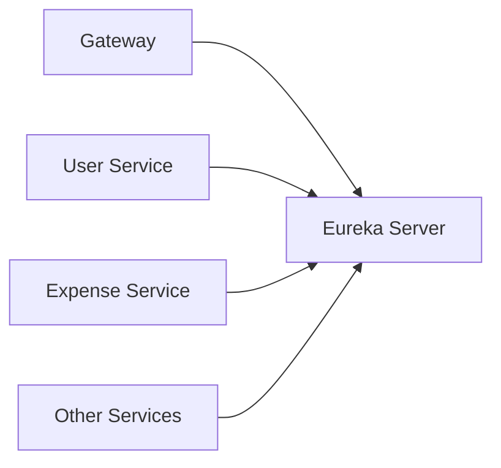
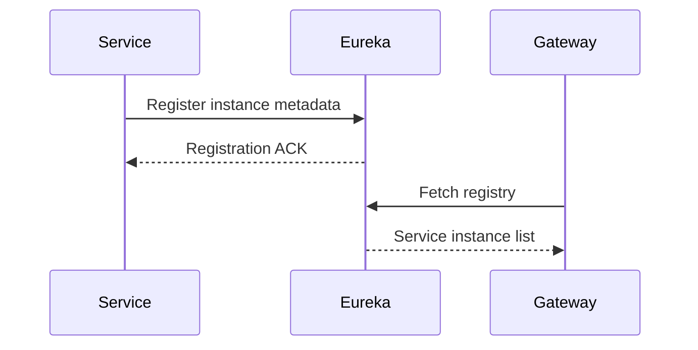
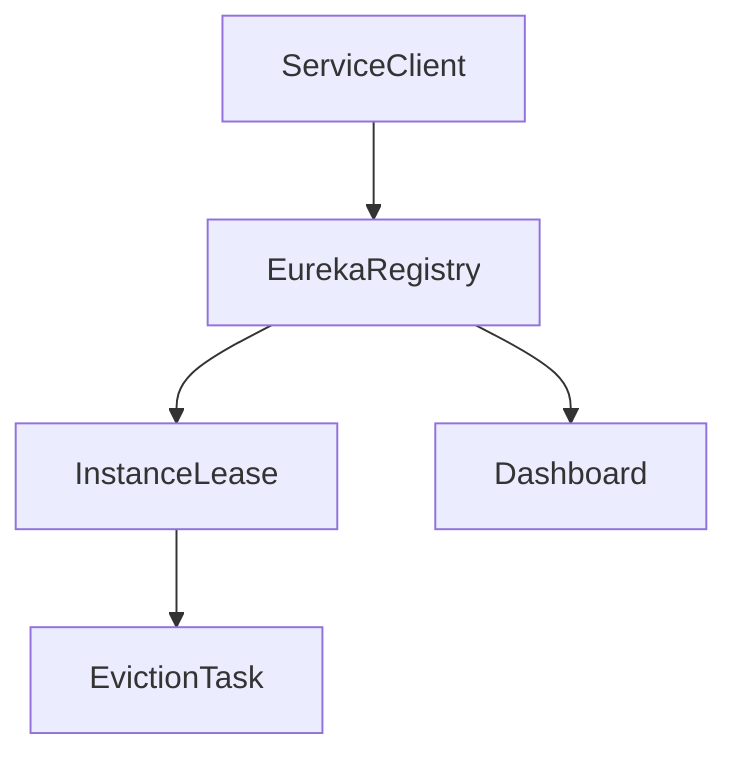

# Eureka Server

## Overview

- **Module**: `eureka-server`
- **Service name**: Eureka registry server
- **Default port**: `8761`
- **Type**: Infrastructure service (service discovery)
- **Responsibility**: Central registry where microservices register and discover each other.

## Responsibilities

- Maintain service instance registry for all backend microservices.
- Provide service discovery metadata for gateway and inter-service calls.
- Expose Eureka dashboard for operational visibility.

## Tech Stack and Dependencies

- Spring Boot 3.x
- Spring Cloud Netflix Eureka Server
- Spring Boot Actuator

## Runtime Configuration

- **Config file**: `src/main/resources/application.yaml`
- **Port**: `server.port=8761`
- **Self-registration**: disabled (`register-with-eureka=false`, `fetch-registry=false`)
- **Default zone**: `http://${eureka.instance.hostname}:${server.port}/eureka`

## Operational Endpoints

| Method | Path | Purpose |
|--------|------|---------|
| `GET` | `/` | Eureka dashboard UI |
| `GET` | `/eureka/apps` | Registered application instances |
| `GET` | `/actuator/health` | Service health |

## Runbook

### Local run

```bash
mvn spring-boot:run
```

### Build

```bash
mvn clean install
```

## UML and Flow Diagrams

### Service context



### Registration sequence



### Internal component view


