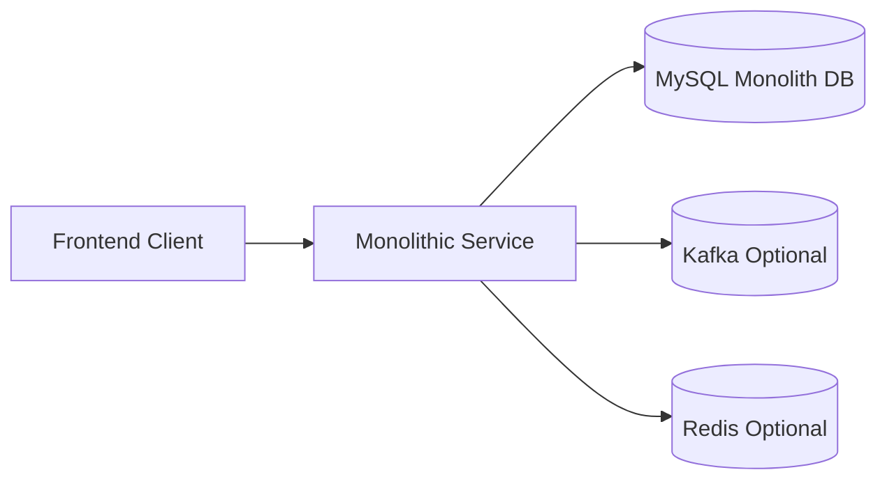
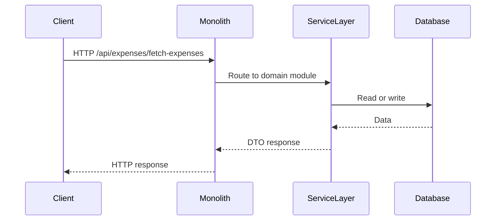
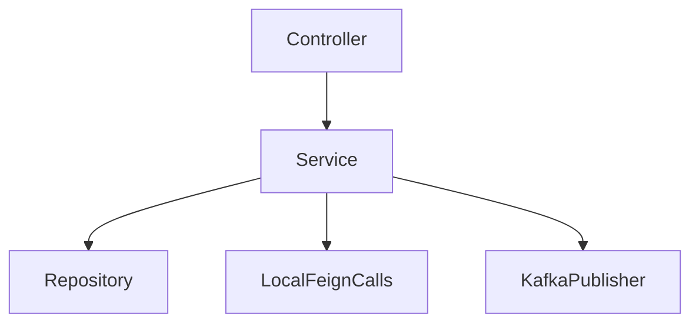

# Monolithic Service

## Overview

- **Module**: `monolithic-service`
- **Service name**: `expense-tracking-monolith`
- **Default port**: `8080`
- **Type**: Alternative deployment profile
- **Responsibility**: Run all backend capabilities in a single JVM process while preserving module boundaries in code.

## Responsibilities

- Host all domain APIs on one port for simplified local deployment.
- Reuse existing service modules through component scanning and shared dependencies.
- Keep Kafka topic names and API paths aligned with microservices mode.

## Tech Stack and Dependencies

- Spring Boot 3.x
- JPA + MySQL
- Kafka (optional)
- Redis (optional)
- Feign clients pointing to local host in monolith mode
- OpenAPI/Swagger

## Runtime Configuration

- **Config file**: `src/main/resources/application.yml`
- **Profile**: `monolithic`
- **Port**: `SERVER_PORT` (default `8080`)
- **DB URL**: `SPRING_DATASOURCE_URL` (default monolith DB `expense_tracker_monolith`)
- **Notable env vars**: `DB_USERNAME`, `DB_PASSWORD`, `KAFKA_BOOTSTRAP_SERVERS`, `REDIS_HOST`, `REDIS_PORT`, `JWT_SECRET`
- **Eureka**: disabled in monolithic mode

## API Surface

All domain routes are served by a single process, including:

- `/auth/**`, `/api/user/**`
- `/api/expenses/**`, `/api/settings/**`, `/daily-summary/**`
- `/api/budgets/**`, `/api/categories/**`, `/api/bills/**`
- `/api/payment-methods/**`, `/api/friendships/**`, `/api/groups/**`
- `/api/notifications/**`, `/api/chats/**`
- `/api/analytics/**`, `/api/search/**`, `/api/shortcuts/**`
- `/api/stories/**`, `/api/events/**`

## Runbook

### Local run

```bash
mvn spring-boot:run "-Dspring.profiles.active=monolithic"
```

### Build

```bash
mvn clean install -P monolithic
```

### Test

```bash
mvn test
```

## UML and Flow Diagrams

### Deployment context



### Request sequence



### Internal component view


