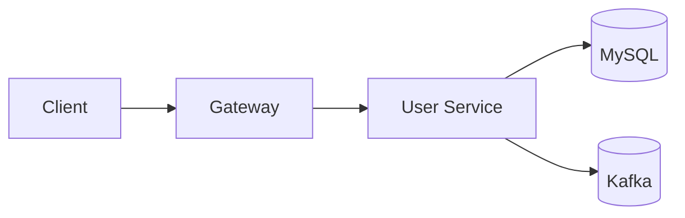
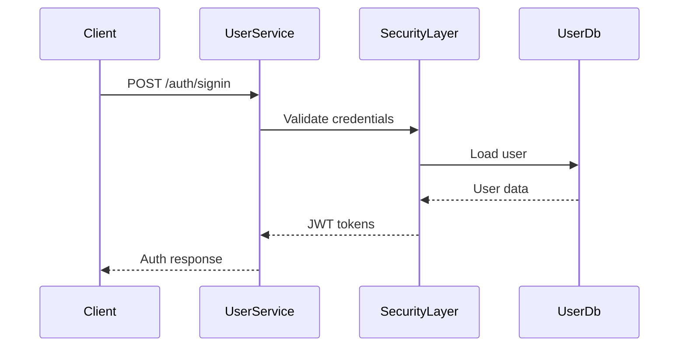
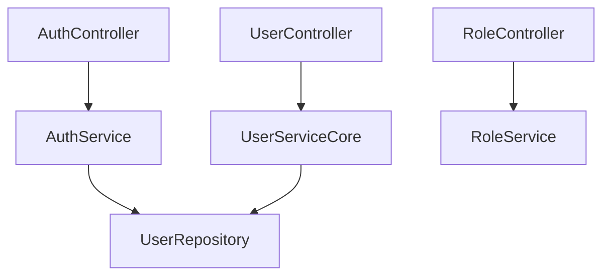

# User Service

## Overview

- **Module**: `user-service`
- **Service name**: `USER-SERVICE`
- **Default port**: `6001`
- **Responsibility**: Authentication, authorization, user profile management, and admin/user role operations.

## Tech Stack and Integrations

- Spring Boot, Spring Web, Spring Security, Spring Data JPA
- Kafka, Eureka Client, WebSocket, Mail
- JWT and OAuth support

## Runtime Configuration

- **Config file**: `src/main/resources/application.yaml`
- **Port**: `server.port=6001`
- **Service registration**: Eureka enabled
- **Key areas**: JWT secret, OAuth settings, DB and mail configuration

## API Endpoints

| Method | Path | Controller |
|--------|------|------------|
| `POST` | `/auth/signup` | `AuthController` |
| `POST` | `/auth/signin` | `AuthController` |
| `POST` | `/auth/verify-login-otp` | `AuthController` |
| `POST` | `/auth/refresh-token` | `AuthController` |
| `PATCH` | `/auth/reset-password` | `AuthController` |
| `GET` | `/api/user/profile` | `UserController` |
| `GET` | `/api/user/{id}` | `UserController` |
| `PUT` | `/api/user` | `UserController` |
| `DELETE` | `/api/user/{id}` | `UserController` |
| `GET` | `/api/roles` | `RoleController` |

## Integration Map

- **Exposes to other services**: user identity and user metadata endpoints.
- **Gateway route**: `/auth/**`, `/api/user/**`, `/api/admin/**`, `/api/roles/**`, `/api/permissions/**`.
- **Async**: publishes/consumes Kafka events for activity and notification workflows.

## Runbook

```bash
mvn spring-boot:run
```

## UML and Flow Diagrams

### Service context



### Login sequence



### Internal view


