# Expense Tracking System

A full-stack personal finance management platform built with **14 Spring Boot microservices**, a **React 18** frontend, and a **BDD automation suite**. Supports two deployment modes -- microservices (with Kafka, Redis, Eureka) or monolithic (single JAR, no external dependencies required) -- using a hexagonal ports-and-adapters architecture for infrastructure toggling.


---

## Product Tour

Expensio Finance combines everyday money management, analytics, collaboration, sharing, and administration in one responsive application.

### Dashboard

The home dashboard summarizes expenses, credit due, budgets, friends, groups, savings, and category trends.

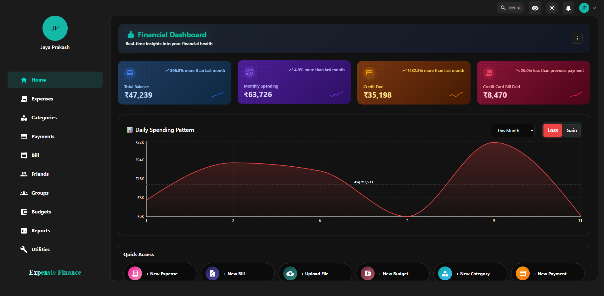

### Expense, Category, and Payment Flows

Each financial area provides a time-based chart, searchable entity cards, and detailed transaction views.

| Expenses | Categories |
|---|---|
| 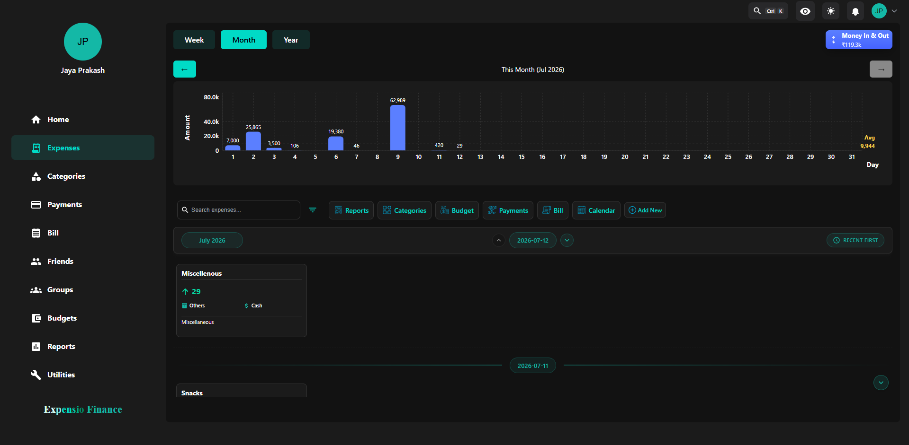 | 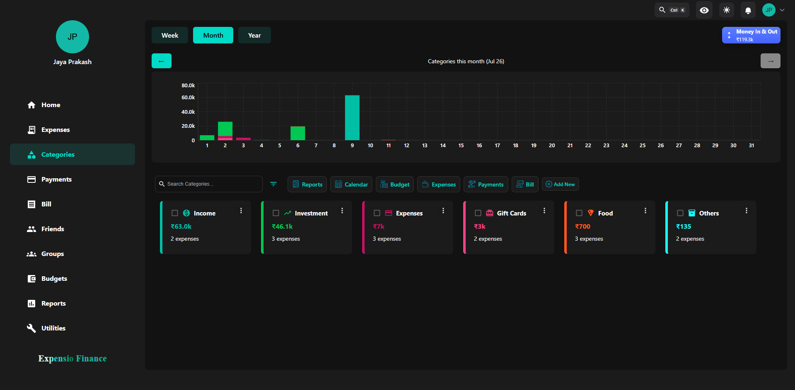 |

| Payment methods | Bills |
|---|---|
| 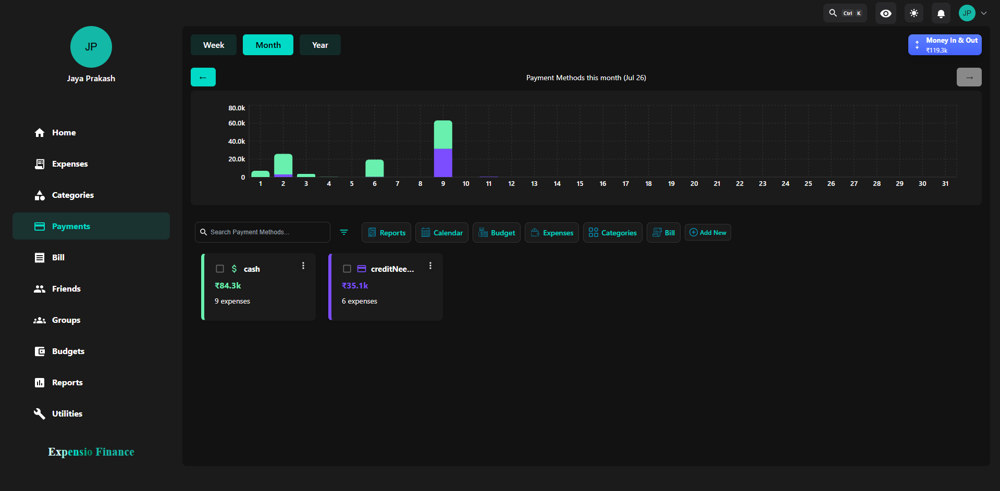 | 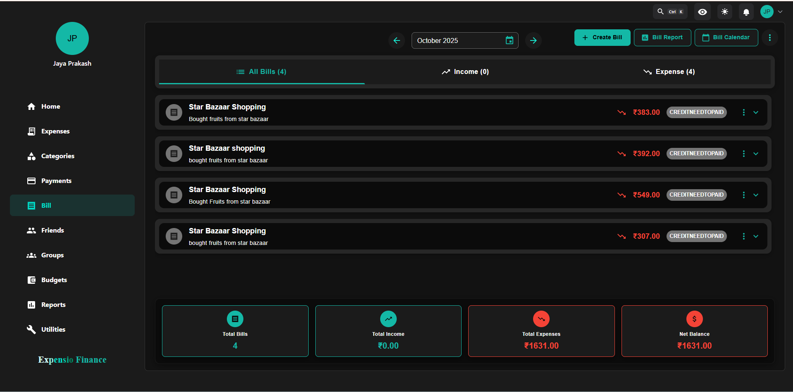 |

### Budgets and Reports

Budget cards show spending progress and remaining balances, while reports provide KPI, trend, distribution, and grouped transaction analysis.

| Budget management | Expense analytics |
|---|---|
| 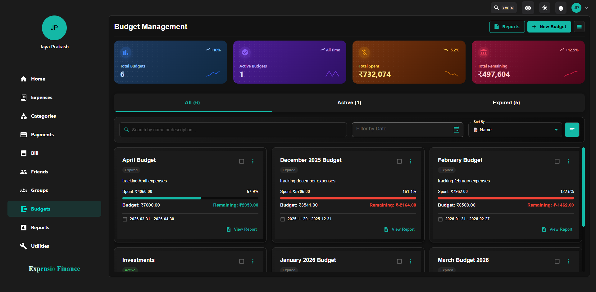 | 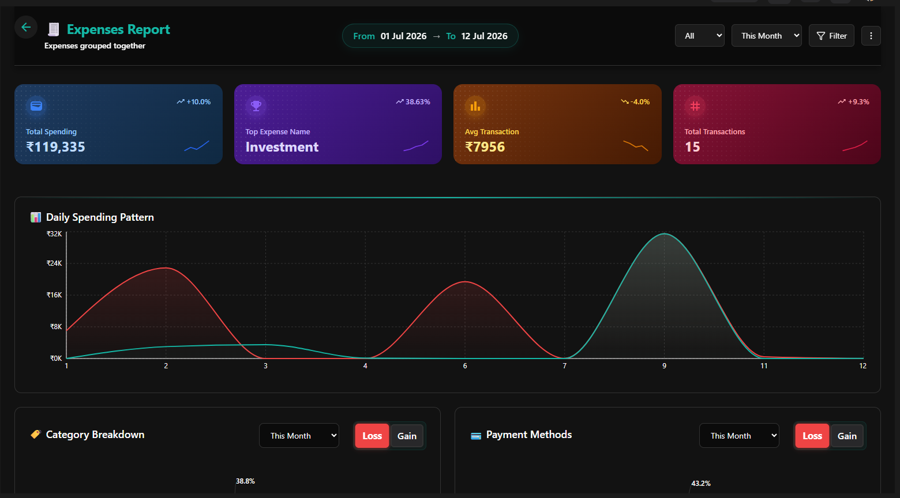 |

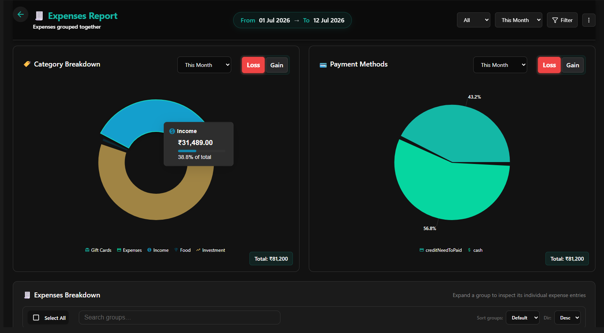

### Friends, Groups, and Sharing

Social features support friend discovery, collaborative groups, controlled data sharing, and public share links.

| Friends | Groups |
|---|---|
| 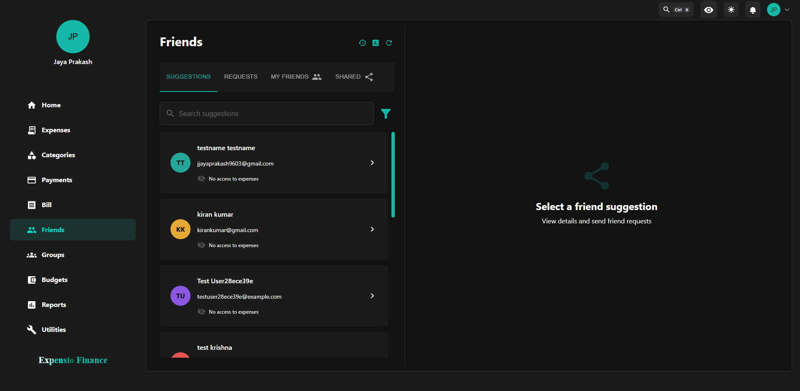 | 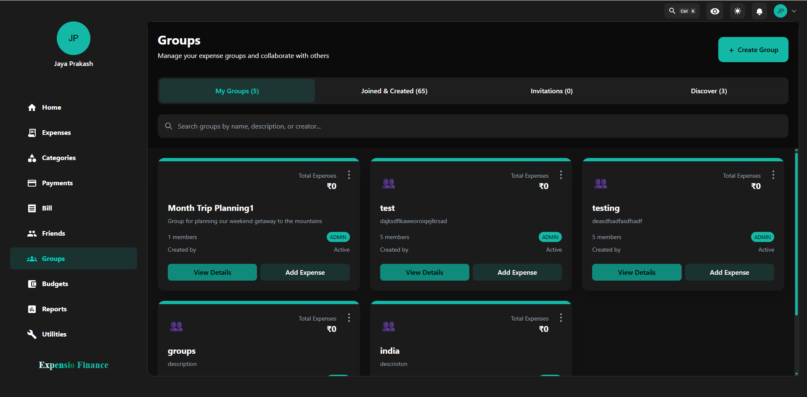 |

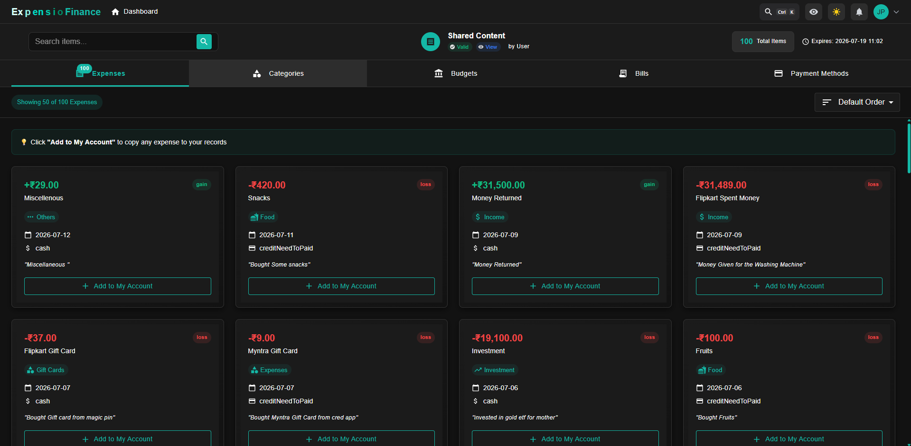

### Personalization and Administration

Users can configure appearance, localization, privacy, storage, accessibility, and smart features. Administrators can manage users, roles, analytics, audit logs, reports, and stories.

| Appearance settings | User management |
|---|---|
| 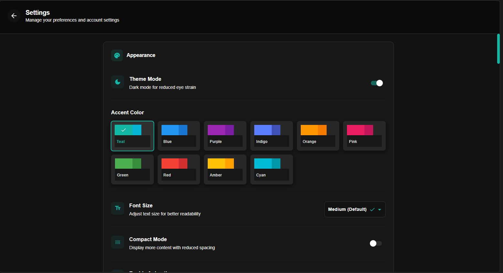 | 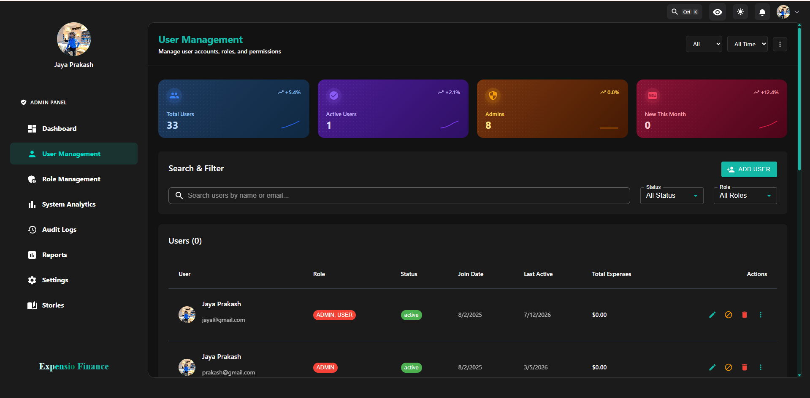 |

See the [complete screenshot gallery](Assets/README.md) for all available product screens.

---

## Table of Contents

- [Product Tour](#product-tour)
- [High-Level Architecture](#high-level-architecture)
- [Repository Structure](#repository-structure)
- [Backend Microservices Architecture](#backend-microservices-architecture)
- [Kafka Event Flows](#kafka-event-flows)
- [Frontend Architecture](#frontend-architecture)
- [Authentication and Security](#authentication-and-security)
- [Hexagonal Architecture (Ports and Adapters)](#hexagonal-architecture-ports-and-adapters)
- [Deployment Modes](#deployment-modes)
- [Quick Start](#quick-start)
- [Automation and Testing](#automation-and-testing)
- [Documentation Index](#documentation-index)

---

## High-Level Architecture

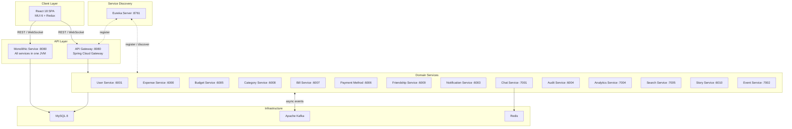

The system can run in either **microservices mode** (Gateway + Eureka + individual services + Kafka + Redis) or **monolithic mode** (single JAR, optional Kafka/Redis). The frontend connects to port 8080 in both modes.

---

## Repository Structure

```
Expense-Tracking-system-With-User/
├── expense-tracking-frontend/          # React 18 SPA
├── expense-tracker-mobile/              # Vite/React mobile-oriented client
├── Expense-tracking-backend/           # Spring Boot backend (Maven multi-module)
│   ├── common-library/                 # Shared DTOs, Feign clients, security, ports
│   ├── user-service/                   # Auth, registration, profile, OAuth2, MFA
│   ├── Expense-Service/                # Expense CRUD, CSV/Excel import, insights
│   ├── Budget-Service/                 # Budget management and expense linking
│   ├── Category-Service/               # Expense categories
│   ├── Bill-Service/                   # Bill tracking and reminders
│   ├── Payment-method-Service/         # Payment methods (cards, wallets, etc.)
│   ├── FriendShip-Service/             # Friends, groups, shared resources
│   ├── Notification-Service/           # Push notifications via WebSocket
│   ├── Chat-Service/                   # Real-time chat (Socket.IO + STOMP)
│   ├── Audit-Service/                  # Audit trail logging
│   ├── AnalyticsService/               # Spending analytics and reports
│   ├── Search-Service/                 # Cross-service universal search
│   ├── Story-Service/                  # Activity stories (spending spikes, etc.)
│   ├── Event-Service/                  # Event management
│   ├── Gateway/                        # Spring Cloud Gateway (microservices mode)
│   ├── eureka-server/                  # Service discovery (microservices mode)
│   └── monolithic-service/             # Single-JVM deployment wrapper
├── Automation/                         # BDD test suite
    ├── automation-core/                # Framework: config, context, logging
    ├── automation-api/                 # REST API test clients
    ├── automation-bdd/                 # Cucumber steps, hooks, runners
    ├── automation-engine-playwright/   # Playwright UI engine
    ├── automation-engine-selenium/     # Selenium UI engine
    ├── automation-ui-flows/            # UI flow definitions
    ├── automation-data/                # Test data management
│   └── test-suites/                    # Feature files and payloads
├── docs/                               # Architecture, security, and runbooks
└── Assets/
    └── screenshots/                    # Product screenshots grouped by feature
```

---

## Backend Microservices Architecture

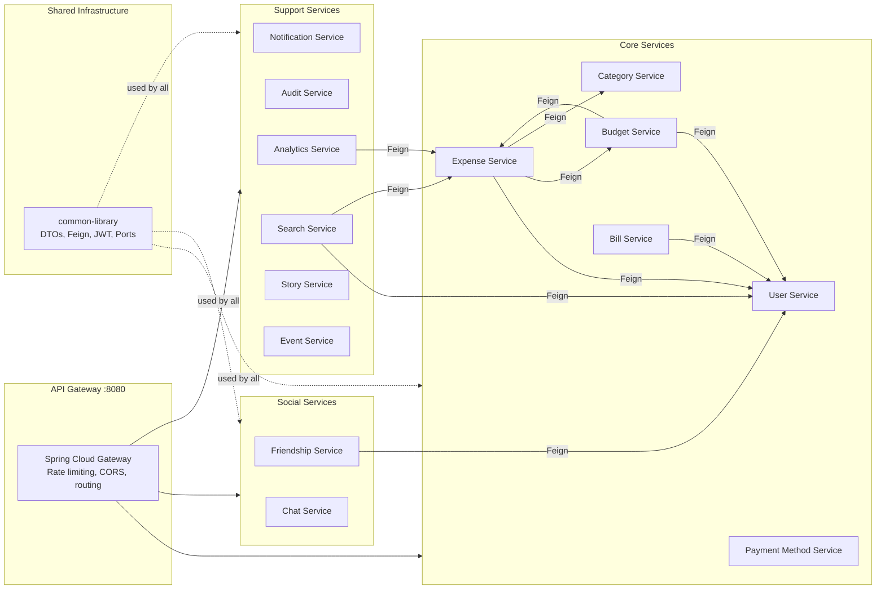

**Synchronous communication** uses OpenFeign clients defined in `common-library`. In monolithic mode, `LocalXxxServiceClient` implementations replace Feign stubs with direct method calls.

**Asynchronous communication** uses Kafka (see next section). When Kafka is disabled, the `InMemoryEventRouter` handles event dispatch within the same JVM.

---

## Kafka Event Flows

```mermaid
flowchart TB
    subgraph producers [Event Producers]
        EP["Expense Service"]
        BP["Budget Service"]
        BLP["Bill Service"]
        CP["Category Service"]
        PP["Payment Method Service"]
        FP["Friendship Service"]
    end

    subgraph topics [Kafka Topics]
        T1["expense-events"]
        T2["budget-events"]
        T3["bill-events"]
        T4["category-events"]
        T5["category-expense-events"]
        T6["payment-method-events"]
        T7["friendship-events"]
        T8["friend-request-events"]
        T9["friend-activity-events"]
        T10["unified-activity-events"]
        T11["audit-events"]
        T12["expense-budget-linking-events"]
        T13["expense-BudgetModel-linking-events"]
        T14["notification-events"]
    end

    subgraph consumers [Event Consumers]
        Story["Story Service"]
        Notif["Notification Service"]
        Audit["Audit Service"]
        FriendC["Friendship Service"]
        BudgetC["Budget Service"]
        ExpenseC["Expense Service"]
        CategoryC["Category Service"]
        PaymentC["Payment Method Service"]
    end

    EP --> T1 & T5 & T6 & T9 & T10 & T11 & T13
    BP --> T2 & T9 & T10 & T12 & T13
    BLP --> T3 & T9 & T10
    CP --> T4 & T9 & T10
    PP --> T6 & T9 & T10
    FP --> T7 & T8 & T9 & T10

    T1 --> Story & Notif
    T2 --> Story & Notif
    T3 --> Story & Notif
    T4 --> Notif
    T5 --> CategoryC
    T6 --> PaymentC & Notif
    T7 --> Notif
    T8 --> Notif
    T9 --> FriendC & Notif
    T10 --> Notif & Audit & FriendC
    T11 --> Audit
    T12 --> BudgetC
    T13 --> ExpenseC
    T14 --> Notif
```

### Key Event Flows

| Flow | Path | Purpose |
|------|------|---------|
| **Notifications** | Domain Service --> `*-events` --> Notification Service --> WebSocket | Real-time push notifications to the browser |
| **Stories** | Expense/Budget/Bill --> `*-events` --> Story Service --> WebSocket | Activity feed stories (spending spikes, budget thresholds, bill reminders) |
| **Audit Trail** | Expense Service --> `audit-events` --> Audit Service | Immutable audit log of financial operations |
| **Budget Linking** | Budget Service --> `expense-budget-linking-events` --> Budget Service | Bi-directional expense-budget association sync |
| **Expense Linking** | Budget Service --> `expense-BudgetModel-linking-events` --> Expense Service | Keep expense records in sync with budget changes |
| **Friend Activity** | All Domain Services --> `friend-activity-events` --> Friendship Service | Aggregate activity for friend feeds |
| **Unified Activity** | All Domain Services --> `unified-activity-events` --> Notification + Audit + Friendship | Cross-cutting activity stream |

---

## Frontend Architecture

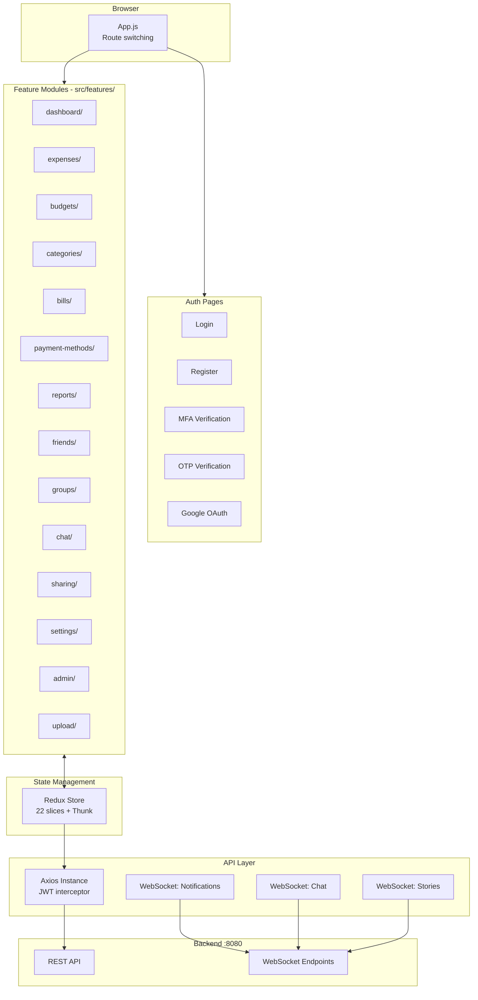

### Tech Stack

| Layer | Technology |
|-------|------------|
| **UI Framework** | React 18.3, MUI 6.2, Tailwind CSS 3.4 |
| **State** | Redux 5.0 + Redux Thunk (classic pattern) |
| **Routing** | React Router 7.0 |
| **Forms** | Formik 2.4 + Yup validation |
| **HTTP** | Axios 1.7 with JWT interceptors |
| **Charts** | Chart.js 4.4, Recharts 2.15 |
| **Real-time** | STOMP.js + SockJS (notifications, stories), Socket.IO (chat) |
| **i18n** | Custom LanguageContext (English, Hindi, Telugu, RTL support) |
| **Auth** | Google OAuth (@react-oauth/google), JWT in localStorage |

### Feature Modules

| Feature | Routes | Description |
|---------|--------|-------------|
| **Dashboard** | `/dashboard` | Spending charts, quick access, daily trends |
| **Expenses** | `/expenses/*` | CRUD, cashflow view, CSV/Excel import |
| **Budgets** | `/budget/*` | Budget creation, tracking, reports |
| **Categories** | `/category-flow/*` | Category management, analytics, calendar |
| **Bills** | `/bill/*` | Bill tracking, reminders, upload |
| **Payment Methods** | `/payment-method/*` | Cards/wallets, flow visualization, reports |
| **Reports** | `/reports`, `/transactions` | Cross-entity reports, monthly summaries |
| **Friends** | `/friends/*` | Friend management, activity feed, shared expenses |
| **Groups** | `/groups/*` | Group creation, shared budgets |
| **Chat** | `/chats`, `/friend-chat` | Real-time messaging |
| **Sharing** | `/my-shares/*`, `/public-shares` | Share expenses publicly or with friends |
| **Settings** | `/settings/*`, `/profile` | Profile, notifications, MFA setup, themes |
| **Admin** | `/admin/*` | User management, roles, audit logs, stories |
| **Upload** | `/upload/*` | Bulk import (expenses, categories, bills) |
| **Calendar** | `/calendar-view` | Calendar view of transactions and bills |

---

## Authentication and Security

```mermaid
sequenceDiagram
    participant U as User
    participant FE as React Frontend
    participant BE as Backend /auth
    participant DB as Database
    participant G as Google OAuth

    rect rgb(40, 40, 60)
    Note over U, DB: Standard Login
    U->>FE: Enter credentials
    FE->>BE: POST /auth/signin
    BE->>DB: Validate credentials
    alt MFA enabled
        BE-->>FE: MFA_REQUIRED + mfaToken
        FE->>U: Show TOTP input
        U->>FE: Enter 6-digit code
        FE->>BE: POST /auth/verify-mfa
        BE-->>FE: JWT token
    else Email OTP enabled
        BE-->>FE: OTP_REQUIRED
        BE->>U: Send OTP email
        U->>FE: Enter OTP
        FE->>BE: POST /auth/verify-login-otp
        BE-->>FE: JWT token
    else No 2FA
        BE-->>FE: JWT token
    end
    FE->>FE: Store JWT in localStorage
    end

    rect rgb(40, 60, 40)
    Note over U, G: Google OAuth
    U->>FE: Click Google Sign-In
    FE->>G: OAuth consent
    G-->>FE: Google credential
    FE->>BE: POST /auth/oauth2/google
    BE->>DB: Find or create user
    BE-->>FE: JWT token
    end
```

### Security Layers

| Layer | Implementation |
|-------|---------------|
| **Authentication** | JWT (jjwt 0.12.3), Google OAuth2, TOTP (dev.samstevens.totp) |
| **Authorization** | Spring Security filter chain, `JwtAuthenticationFilter` in common-library |
| **Token Storage** | `localStorage.jwt` on frontend, validated per-request on backend |
| **API Protection** | All endpoints require `Authorization: Bearer <token>` (except `/auth/**`) |
| **CORS** | Configured in Gateway and individual services |
| **Rate Limiting** | Gateway: 10 requests / 60 seconds |

---

## Hexagonal Architecture (Ports and Adapters)

The monolithic service can run **without Kafka and Redis** using in-memory adapters, controlled by two feature flags.

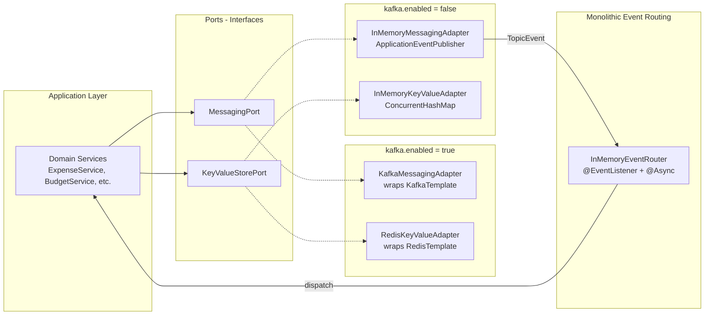

### Configuration Flags

| Flag | Default (Monolith) | Effect when `false` |
|------|-------------------|---------------------|
| `kafka.enabled` | `false` | Uses `InMemoryMessagingAdapter` + `InMemoryEventRouter` instead of Kafka |
| `redis.enabled` | `false` | Uses `InMemoryKeyValueAdapter` (ConcurrentHashMap) instead of Redis |

### Key Files

| File | Purpose |
|------|---------|
| `common-library/.../messaging/MessagingPort.java` | Event publishing interface |
| `common-library/.../messaging/KafkaMessagingAdapter.java` | Kafka-backed implementation |
| `common-library/.../messaging/InMemoryMessagingAdapter.java` | In-memory fallback using Spring events |
| `common-library/.../cache/KeyValueStorePort.java` | Key-value store interface |
| `common-library/.../cache/RedisKeyValueAdapter.java` | Redis-backed implementation |
| `common-library/.../cache/InMemoryKeyValueAdapter.java` | In-memory fallback using ConcurrentHashMap |
| `monolithic-service/.../config/InMemoryEventRouter.java` | Routes in-memory events to service handlers |
| `monolithic-service/.../config/MonolithicInfraConfig.java` | Conditional auto-config re-enablement |

---

## Deployment Modes

| Aspect | Microservices | Monolithic |
|--------|---------------|------------|
| **Build command** | `mvn clean install -P microservices` | `mvn clean install -P monolithic` |
| **Entry point** | Gateway (8080) + Eureka (8761) + 14 services | MonolithicApplication (8080) |
| **Database** | Per-service databases | Single DB: `expense_tracker_monolith` |
| **Kafka** | Required | Optional (`kafka.enabled=false`) |
| **Redis** | Required (Chat Service) | Optional (`redis.enabled=false`) |
| **Eureka** | Enabled | Disabled |
| **Feign calls** | HTTP over network | In-process `LocalXxxServiceClient` |
| **Docker Compose** | `expense-tracking-backend/docker-compose.yml` | `expense-tracking-backend/docker-compose.monolith.yml` |
| **Recommended for** | Production, scaling | Development, demos, single-server |

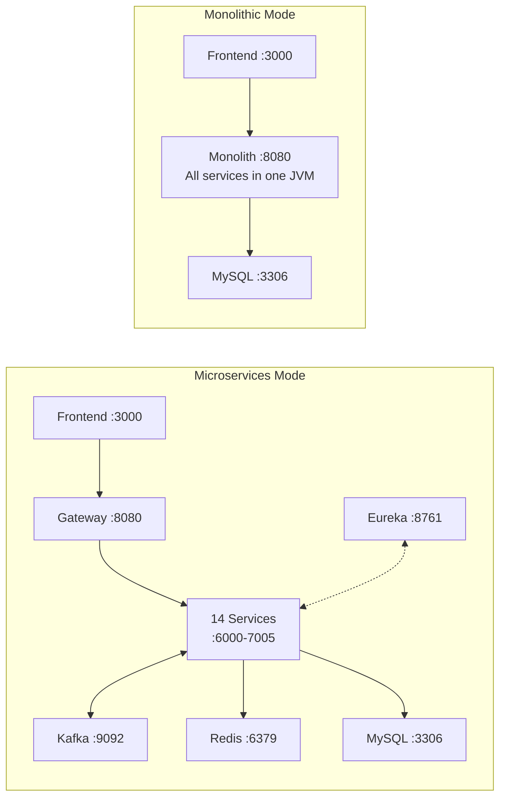

### Port Reference

| Service | Port |
|---------|------|
| API Gateway / Monolith | 8080 |
| Eureka Server | 8761 |
| User Service | 6001 |
| Expense Service | 6000 |
| Budget Service | 6005 |
| Category Service | 6008 |
| Bill Service | 6007 |
| Payment Method Service | 6006 |
| Friendship Service | 6009 |
| Notification Service | 6003 |
| Chat Service | 7001 |
| Audit Service | 6004 |
| Analytics Service | 7004 |
| Search Service | 7005 |
| Story Service | 6010 |
| Event Service | 7002 |
| Frontend (dev) | 3000 |
| Frontend (Docker) | 80 |
| MySQL | 3306 (container) / 5000 (host) |
| Kafka | 9092 |
| Redis | 6379 |

---

## Quick Start

### Prerequisites

- Java 17+
- Node.js 20+
- Maven 3.9+
- MySQL 8

### Option A: Monolithic Mode (simplest)

```bash
# 1. Create the database
mysql -u root -p -e "CREATE DATABASE expense_tracker_monolith;"

# 2. Build the backend
cd Expense-tracking-backend
mvn clean install -P monolithic -DskipTests

# 3. Run the monolithic service
cd monolithic-service
java -jar target/monolithic-service-1.0.0.jar

# 4. In a separate terminal, start the frontend
cd expense-tracking-frontend
npm install
npm start
```

The backend runs on `http://localhost:8080` and the frontend on `http://localhost:3000`.

### Option B: Microservices Mode (with Docker)

```bash
# Start infrastructure (MySQL, Kafka, Redis, Zookeeper)
docker-compose up -d

# Build all services
cd Expense-tracking-backend
mvn clean install -P microservices -DskipTests

# Start Eureka first, then Gateway, then domain services
java -jar eureka-server/target/eureka-server-0.0.1.jar
java -jar Gateway/target/gateway-0.0.1-SNAPSHOT.jar
# ... start each service JAR

# Start the frontend
cd expense-tracking-frontend
npm install && npm start
```

### Option C: Full Docker Compose

```bash
# Microservices stack
cd Expense-tracking-backend
docker-compose up --build

# OR monolithic stack
cd Expense-tracking-backend
docker-compose -f docker-compose.monolith.yml up --build
```

### Environment Variables

| Variable | Default | Description |
|----------|---------|-------------|
| `REACT_APP_API_BASE_URL` | `http://localhost:8080` | Backend API URL for the frontend |
| `REACT_APP_GOOGLE_CLIENT_ID` | -- | Google OAuth client ID |
| `KAFKA_ENABLED` | `false` (monolith) | Enable Kafka messaging |
| `REDIS_ENABLED` | `false` (monolith) | Enable Redis caching |
| `JWT_SECRET` | configured in application.yml | JWT signing secret |
| `MYSQL_HOST` | `localhost` | Database host |

---

## Automation and Testing

The `Automation/` module provides a comprehensive BDD test suite with support for both API and UI testing.

| Component | Technology | Purpose |
|-----------|------------|---------|
| **BDD Framework** | Cucumber 7.21 + TestNG 7.11 | Behavior-driven test scenarios |
| **API Testing** | RestAssured 5.5 | REST endpoint validation |
| **UI Engine** | Playwright 1.57 or Selenium 4.28 | Browser automation (selectable via config) |
| **Reporting** | Allure 2.24 | Test reports with screenshots and traces |
| **Runner** | Spring Boot 3.4.2 | Dependency injection for test infrastructure |
| **CI** | Jenkins pipeline | Automated test execution |

### Running Tests

```bash
cd Automation

# API smoke tests
mvn test -pl automation-bdd -Dcucumber.filter.tags="@smoke"

# UI tests with Playwright
mvn test -pl automation-bdd -Dautomation.engine=playwright -Dcucumber.filter.tags="@ui"

# Full regression
mvn test -pl automation-bdd -Dcucumber.filter.tags="@regression"
```

### Test Coverage

30+ feature files covering: authentication (login, signup, OTP, MFA), user management, expenses (CRUD, import), budgets, friends, groups, sharing, chat, settings, and admin operations.

---

## Documentation Index

### Backend

| Module | README |
|--------|--------|
| Backend Overview | [Expense-tracking-backend/README.md](Expense-tracking-backend/README.md) |
| Common Library | [common-library/README.md](Expense-tracking-backend/common-library/README.md) |
| Monolithic Service | [monolithic-service/README.md](Expense-tracking-backend/monolithic-service/README.md) |
| API Gateway | [Gateway/README.md](Expense-tracking-backend/Gateway/README.md) |
| Eureka Server | [eureka-server/README.md](Expense-tracking-backend/eureka-server/README.md) |
| User Service | [user-service/README.md](Expense-tracking-backend/user-service/README.md) |
| Expense Service | [Expense-Service/README.md](Expense-tracking-backend/Expense-Service/README.md) |
| Budget Service | [Budget-Service/README.md](Expense-tracking-backend/Budget-Service/README.md) |
| Category Service | [Category-Service/README.md](Expense-tracking-backend/Category-Service/README.md) |
| Bill Service | [Bill-Service/README.md](Expense-tracking-backend/Bill-Service/README.md) |
| Payment Method Service | [Payment-method-Service/README.md](Expense-tracking-backend/Payment-method-Service/README.md) |
| Friendship Service | [FriendShip-Service/README.md](Expense-tracking-backend/FriendShip-Service/README.md) |
| Notification Service | [Notification-Service/README.md](Expense-tracking-backend/Notification-Service/README.md) |
| Chat Service | [Chat-Service/README.md](Expense-tracking-backend/Chat-Service/README.md) |
| Audit Service | [Audit-Service/README.md](Expense-tracking-backend/Audit-Service/README.md) |
| Analytics Service | [AnalyticsService/README.md](Expense-tracking-backend/AnalyticsService/README.md) |
| Search Service | [Search-Service/README.md](Expense-tracking-backend/Search-Service/README.md) |
| Story Service | [Story-Service/README.md](Expense-tracking-backend/Story-Service/README.md) |
| Event Service | [Event-Service/README.md](Expense-tracking-backend/Event-Service/README.md) |

### Frontend

| Module | README |
|--------|--------|
| Frontend App | [expense-tracking-frontend/README.md](expense-tracking-frontend/README.md) |

### Automation

| Module | README |
|--------|--------|
| User Service API Tests | [Automation/README-user-service-api.md](Automation/README-user-service-api.md) |
