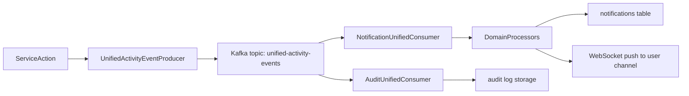
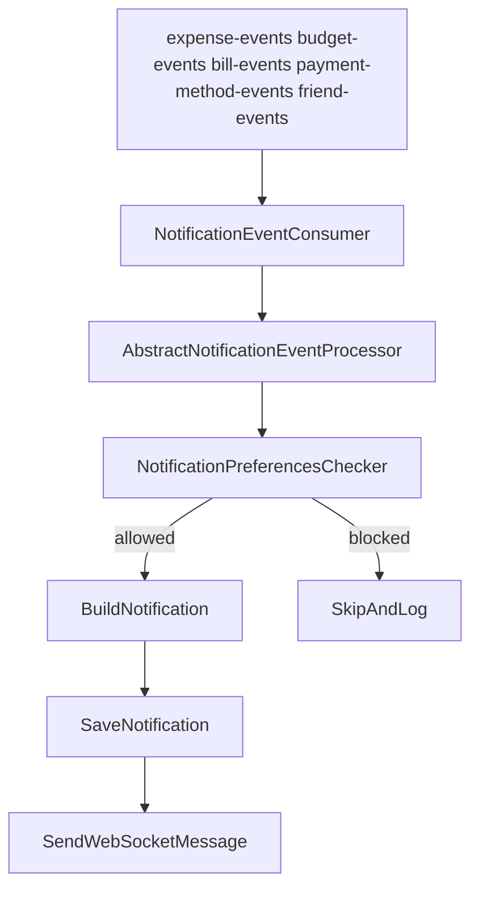
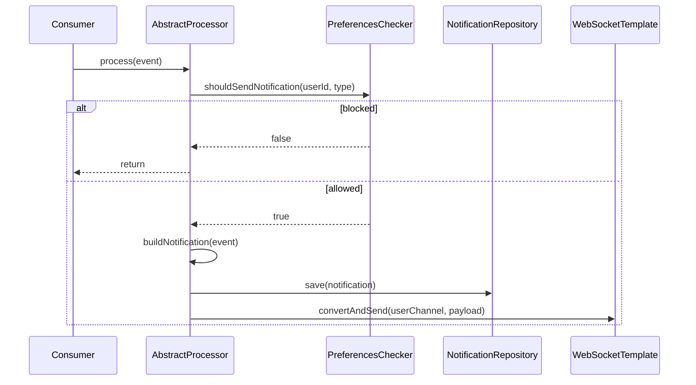

# Event and Data Flows

This document consolidates Kafka, pipeline, and runtime event flow documentation.

## Unified Activity Event Model

The architecture converged from multiple per-action events to a unified activity event pattern.

## Notification Processing Pipeline

## Template Method Execution

## Budget/Bill/Expense Event Semantics

Domain events are mapped to user-facing notification types with priority tiers:

- Expense: create, update, delete, large-expense alert
- Budget: created, updated, warning, exceeded, limit approaching
- Bill: reminder, overdue, paid, updated
- Friendship: request and relationship lifecycle events

## Batch and Throughput Considerations

Legacy batch architecture docs introduced:

- batch-oriented consumer handling for notification workloads
- optimization for reduced processing overhead under high event throughput
- quick-reference operational checks for lag and consumer behavior

## CI/CD Event Flow

Jenkins pipeline docs were standardized as operational documentation. The canonical runbook is now:

- `docs/operations/deployment-and-runbooks.md`

## Legacy Sources Consolidated

Key source documents merged into this page:

- `UNIFIED_EVENT_ARCHITECTURE.md`
- `ARCHITECTURE_DIAGRAMS.md`
- `MODULAR_NOTIFICATION_ARCHITECTURE.md`
- `BATCH_PROCESSING_ARCHITECTURE.md`
- `BATCH_PROCESSING_QUICK_REFERENCE.md`
- `PAYMENT_METHOD_ARCHITECTURE.md` (event-flow portions)
