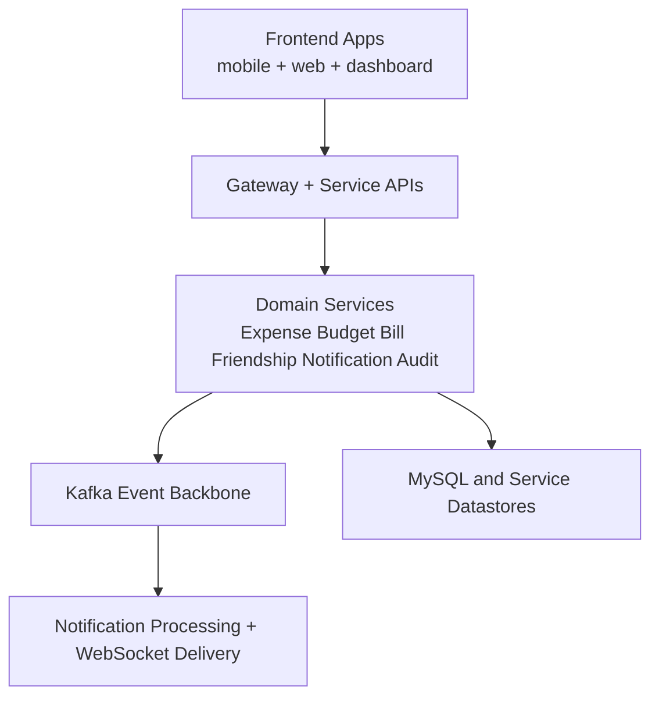
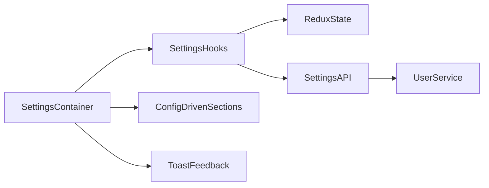

# Architecture Overview

This document consolidates high-level architecture from legacy docs focused on:

- modular frontend component architecture
- settings component decomposition
- cross-cutting reusable hooks/utilities patterns
- notification and domain-driven service boundaries

## System Layers

## Frontend Modularization Pattern

The project standardizes on reusable building blocks:

- `components/` for presentational and reusable components
- `hooks/` for stateful domain logic
- `utils/` for pure, testable helpers
- config-driven rendering where possible (for example settings sections)

This pattern was repeatedly applied in legacy architecture docs for settings, autocomplete flows, and payment method handling.

## Settings Feature Architecture

The settings feature evolved from a monolithic implementation into modular units:

- section-driven rendering model
- focused hooks for dialog state, settings state, and action orchestration
- backend-backed user preferences and frontend sync

## Architectural Principles Used

- Single Responsibility: per-domain processors/hooks/components
- Open/Closed: extend via new processors/components instead of modifying core workflow
- DRY: template-method and reusable component patterns
- Dependency Inversion: consumers depend on interfaces/contracts

## Canonical Architecture Artifacts

- Event-driven and Kafka flow details: `docs/architecture/event-and-data-flows.md`
- Notification feature architecture: `docs/features/notifications/overview.md`
- Deployment topology and ops links: `docs/operations/deployment-and-runbooks.md`

## Legacy Sources Consolidated

Primary source families merged here include:

- `MODULAR_ARCHITECTURE.md`
- `ARCHITECTURE.md` (settings-focused architecture)
- `PAYMENT_METHOD_ARCHITECTURE.md` (for reusable architecture pattern framing)
- related settings/theme modularization summaries listed in the source map
