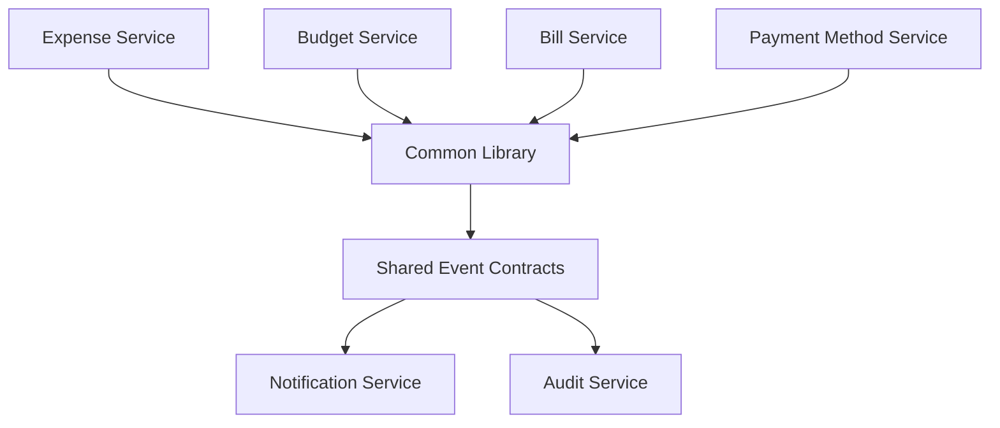

# Backend Services Overview

This document consolidates backend service refactoring and shared-library documentation.

## Scope

- expense service refactoring notes
- budget service backend additions
- excel service extraction/refactoring
- common library usage for shared DTOs/events/errors

## Service Collaboration Model

## Key Consolidated Themes

### Expense Domain

- service refactoring for maintainability and event integration
- improvements summary for expense-related backend behavior

### Budget Domain

- additional service methods and report-oriented backend support
- tighter integration with notification and analytics workflows

### Excel and Export

- modularization of excel handling for improved maintainability
- consolidation of excel service responsibilities

### Shared Library

- centralized event DTOs and common contracts
- reusable error/utility patterns for cross-service consistency

## Related Docs

- architecture and event topology: `docs/architecture/event-and-data-flows.md`
- feature-level behavior: `docs/features/notifications/overview.md`
- performance and query tuning: `docs/performance-reliability/optimization-and-fixes.md`

## Legacy Sources Consolidated

- `common-library_README.md`
- `EXPENSE_SERVICE_REFACTORING.md`
- `expenses_EXPENSE_SERVICE_REFACTORING.md`
- `EXPENSE_SERVICES_IMPROVEMENTS_SUMMARY.md`
- `EXCEL_SERVICE_REFACTORING.md`
- `EXCEL_REFACTORING_SUMMARY.md`
- `BUDGET_SERVICE_ADDITIONAL_METHODS.md`
