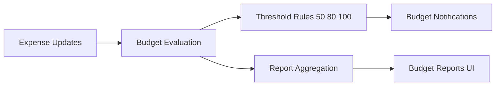

# Budget, Bills, and Reports Overview

This document consolidates budget, bill notification, and reporting documentation.

## Scope

- budget creation/update and threshold tracking
- bill lifecycle notifications and reminders
- budget and spending reports, analytics, and visual components
- quick-start and API integration notes for reporting features

## Budget Signal Flow

## Core Functional Areas

### Budget

- threshold-driven notifications
- component redesign and visualization refinements
- report API integration and analytics snapshots

### Bills

- bill event notifications for due, paid, reminder, overdue states
- frontend display and notification routing integration

### Reports

- history and trend-oriented reporting views
- quick reference pathways for budget analytics
- detailed budget report implementation trajectory

## Implementation Notes

- budget and bill events participate in the shared notification infrastructure
- report views depend on accurate categorization and date formatting behavior
- quick-reference docs are merged into this canonical guide

## Related Docs

- notifications system behavior: `docs/features/notifications/overview.md`
- backend implementation specifics: `docs/backend-services/overview.md`
- performance and query optimization: `docs/performance-reliability/optimization-and-fixes.md`

## Legacy Sources Consolidated

- `BUDGET_*`
- `BILL_NOTIFICATION_*`
- `DETAILED_BUDGET_REPORT_IMPLEMENTATION_COMPLETE.md`
- `ReportsHistory_README.md`
- `QUICK_REFERENCE_BUDGET_ANALYTICS.md`
- `DailySpendingChart.examples.md`
- `DateIndicator.README.md`
