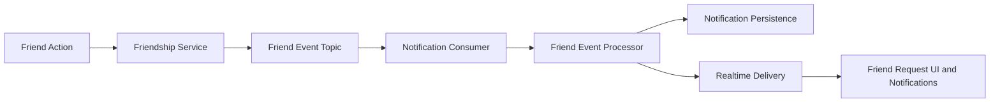

# Friends Feature Overview

This document consolidates friend request, friendship lifecycle, and friend-activity notification documentation.

## Scope

- friend request send/receive/accept/reject flows
- friendship lifecycle updates and feature completion status
- integration with notification infrastructure
- missing feature gaps and implementation checklist history

## Friend Event Flow

## Consolidated Behavior

- request lifecycle notifications are generated for relevant actors/targets
- friend activity notifications are routed through the same preference-aware gate
- quick-start and implementation docs are merged into canonical feature guidance

## Gaps and Follow-up

Legacy gap notes are preserved in traceability:

- missing feature analyses are tracked in the source map
- completion checklists are consolidated for historical context

## Related Docs

- notification architecture and runtime: `docs/features/notifications/overview.md`
- event topology: `docs/architecture/event-and-data-flows.md`
- testing runbook: `docs/features/notifications/testing-and-troubleshooting.md`

## Legacy Sources Consolidated

- `FRIEND_REQUEST_*`
- `FRIENDS_*`
- `FRIENDSHIP_NOTIFICATION_IMPLEMENTATION.md`
- `MISSING_FRIENDS_FEATURES.md`
- `IMPLEMENTATION_CHECKLIST.md` (friends parity checklist)
