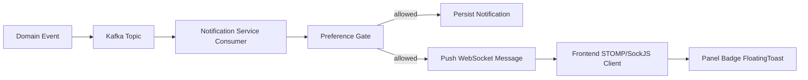

# Notifications Overview

This is the canonical feature guide for the notification system, consolidating implementation, quick starts, visual docs, and integration summaries.

## Scope

The notification feature includes:

- Kafka-driven event intake from domain services
- preference-aware notification generation
- persistence in notification tables
- real-time delivery using WebSocket channels
- frontend display surfaces (floating notifications, panel, badge updates)
- Redux integration for state orchestration

## End-to-End Flow

## Core Backend Elements

- consumer listeners for expense, budget, bill, payment method, and friendship events
- processor model with shared template-method flow
- preference checker supporting service-level and notification-level toggles
- critical-notification exceptions where required

## Core Frontend Elements

- notification panel and unread badge updates
- floating notification renderer and toast-like UX behaviors
- Redux state integration for feed and settings interactions
- WebSocket subscription and payload handling in client runtime

## Setup and Quick Start (Consolidated)

1. Ensure dependent services are running (gateway, user/auth, notification, and producer services).
2. Ensure Kafka and related broker stack is available.
3. Trigger representative domain events (expense, budget, bill, friendship).
4. Verify:
   - DB insertion
   - WebSocket delivery
   - frontend panel/badge/floating update

Detailed command-level checks now live in `docs/features/notifications/testing-and-troubleshooting.md`.

## Feature Evolution Highlights

- unified event routing improvements reduced multi-event duplication
- floating notification system introduced richer on-screen delivery
- display integration and settings integration reduced mismatch between backend preferences and frontend rendering
- Redux modules were refactored for feature consistency

## UI/UX Visuals

Legacy visual markdown assets have been normalized into structured flow documentation. Mermaid is now used for architecture and process visuals; ASCII-only diagrams were consolidated.

## Related Docs

- settings and API details: `docs/features/notifications/settings-and-preferences.md`
- test and troubleshooting workflows: `docs/features/notifications/testing-and-troubleshooting.md`
- architecture-level event flow: `docs/architecture/event-and-data-flows.md`

## Legacy Sources Consolidated

This page consolidates the following source families:

- `NOTIFICATION_SYSTEM_*`
- `NOTIFICATION_SERVICE_IMPLEMENTATION.md`
- `NOTIFICATION_IMPLEMENTATION_SUMMARY.md`
- `NOTIFICATION_DISPLAY_INTEGRATION.md`
- `NOTIFICATION_VISUAL_*`
- `FLOATING_NOTIFICATIONS_*` and `FloatingNotifications_*`
- `REDUX_NOTIFICATION_COMPLETE.md`
- `QUICK_START*.md` and `NOTIFICATION_QUICK*.md`
- `API_INTEGRATION_UPDATE.md`
