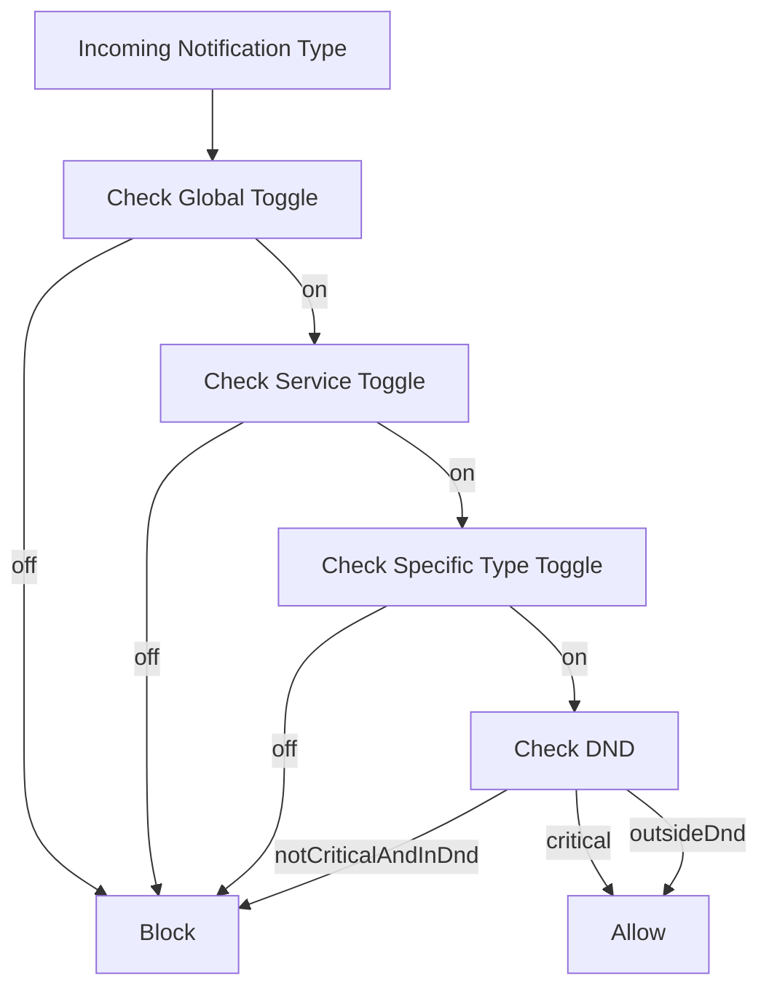

# Notification Settings and Preferences

This document consolidates notification preference APIs, Redux integration, and frontend-backend synchronization guidance.

## Preference Domains

Preferences are layered:

- global toggle (`allNotificationsEnabled`)
- service toggles (expense, budget, bill, payment method, friend domains)
- notification-type toggles (fine-grained event controls)
- delivery behavior controls (for example DND windows and behavior options)

## Preference Evaluation Flow

## API Surface (Consolidated)

Core responsibilities captured from legacy API docs:

- read current user notification preferences
- update selected preferences
- persist and return synchronized preference state

API contracts should continue to align with Notification Service preference DTOs and frontend state shape.

## Frontend Integration

Redux integration patterns include:

- centralized preference fetch and update actions
- optimistic or post-confirmation UI update strategy
- UI toggles mapped to API payload keys
- fallback/default initialization for first-time users

## Backend Integration

Backend persistence and service logic include:

- preference entity storage with default strategy
- query and update methods supporting partial updates
- preference-check service used by event processors before persistence and real-time delivery

## Cross-Layer Contract Guidelines

1. Keep naming parity between API payload keys and frontend selectors.
2. Version preference payload changes when introducing new toggles.
3. Add migration defaults when introducing new boolean fields.
4. Preserve backward compatibility for clients that do not send newly introduced fields.

## Related Docs

- system overview: `docs/features/notifications/overview.md`
- runtime diagnosis and tests: `docs/features/notifications/testing-and-troubleshooting.md`
- security baseline (auth/rate/cors): `docs/SECURITY.md`

## Legacy Sources Consolidated

- `NOTIFICATION_PREFERENCES_API_DOCUMENTATION.md`
- `NOTIFICATION_SETTINGS_DOCUMENTATION.md`
- `NOTIFICATION_SETTINGS_COMPLETE_SUMMARY.md`
- `REDUX_NOTIFICATION_PREFERENCES_INTEGRATION.md`
- `FRONTEND_BACKEND_INTEGRATION_GUIDE.md`
- `QUICK_REFERENCE_GUIDE.md`
