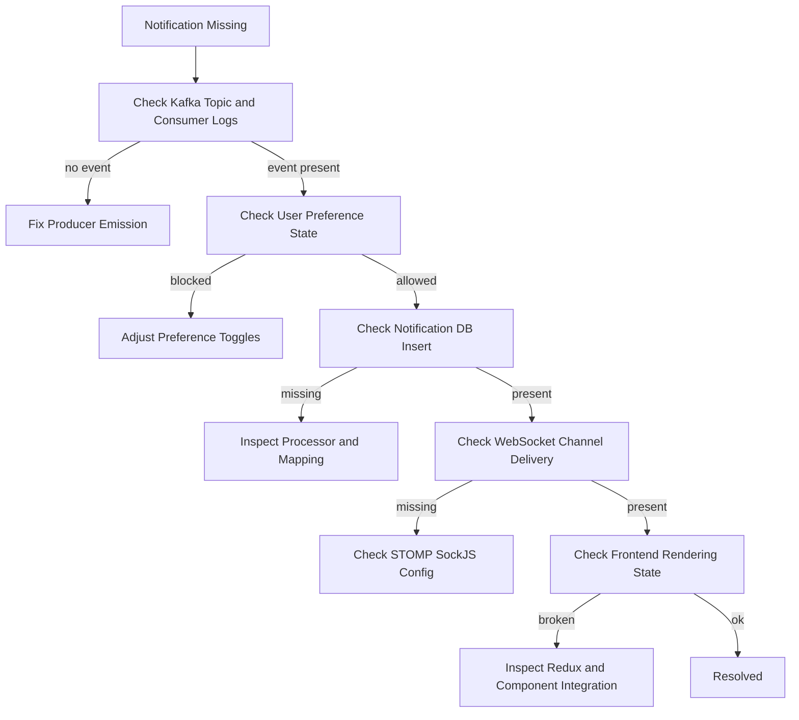

# Notification Testing and Troubleshooting

This runbook consolidates verification and troubleshooting for notification ingestion, persistence, and UI delivery.

## Validation Matrix

Validate all three stages for each event type:

1. ingestion (Kafka consumer receives event)
2. persistence (notification record stored)
3. delivery (WebSocket + UI update)

## Quick Validation Checklist

- broker stack is healthy and topics exist
- Notification Service is running and subscribed to expected topics
- producer service emits a known event payload
- notification appears in database
- client receives WebSocket message for the target user
- panel/badge/floating notification updates in UI

## Troubleshooting Decision Flow

## Common Failure Patterns

### 1) Event received but no notification persisted

- notification type mapping mismatch
- serializer/deserializer contract mismatch
- processor exception before save path

### 2) Persisted but not visible in UI

- WebSocket destination mismatch
- client subscription not attached for active user
- frontend reducer/state path mismatch

### 3) Preferences unexpectedly blocking events

- global toggle disabled
- service-specific toggle disabled
- DND behavior blocking non-critical notifications

## Recommended Debug Artifacts

- Kafka consumer logs (per topic and group)
- processor-level decision logs for preference checks
- DB rows from notifications and preference tables
- browser console network/WebSocket traces
- Redux state snapshots for notification slice

## Regression Test Scenarios

1. expense create and large-expense alert path
2. budget threshold warnings and exceeded path
3. bill reminder/overdue path
4. friend request receive/accept/reject path
5. preferences toggle disabled path
6. DND mode with critical bypass path

## Related Docs

- feature behavior and architecture: `docs/features/notifications/overview.md`
- preferences and API contract: `docs/features/notifications/settings-and-preferences.md`
- event topology: `docs/architecture/event-and-data-flows.md`

## Legacy Sources Consolidated

- `WEBSOCKET_FIX_GUIDE.md`
- `NOTIFICATION_WEBSOCKET_FIX_SUMMARY.md`
- `QUICK_START_NOTIFICATION_TESTING.md`
- `EXPENSE_NOTIFICATION_VERIFICATION.md`
- `FLOATING_NOTIFICATIONS_TESTING.md`
