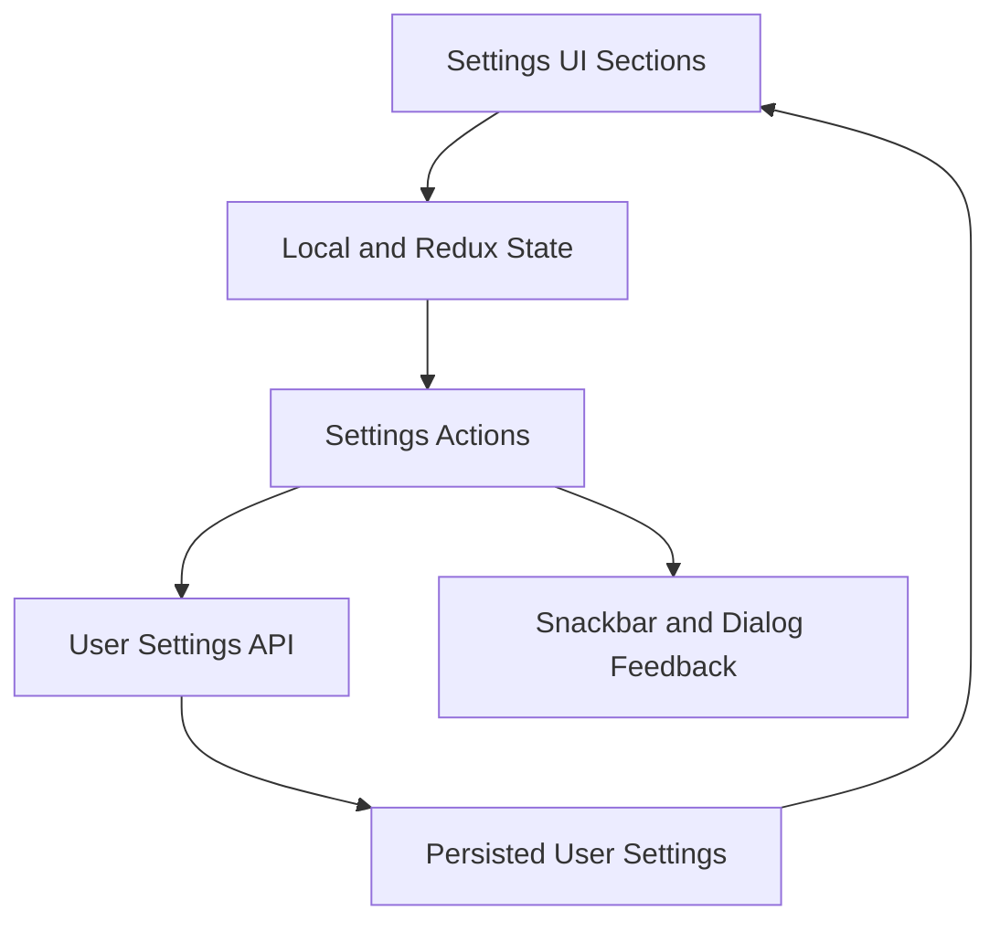

# Settings, Theme, and UI Overview

This document consolidates settings, theme system, and UI component refactoring material.

## Scope

- settings modularization and backend persistence
- user settings Redux integration and utility usage
- theming architecture and migration patterns
- accordion/header/calendar/tooltip UI evolution
- role-based login/navigation UI updates

## Settings Architecture Snapshot

## Theme System Highlights

- centralized color and dark/light theme handling
- component migration guidance for themed styling consistency
- synchronization between persisted user settings and runtime theme state
- visual comparison and palette references standardized in one location

## UI Refactoring Highlights

- settings moved from monolithic implementation to modular sections/hooks/components
- accordion and grouped layout behavior standardized
- header and supporting UI elements aligned with notification entry points
- calendar and tooltip UI customizations consolidated into reusable patterns

## Login and Navigation Notes

- role-aware login routing behaviors documented and stabilized
- fixes for role-based navigation mismatch captured in consolidated guidance

## Engineering Practices Embedded

- config-driven rendering where possible
- reusable components and hooks over duplicated ad-hoc logic
- frontend-backend contract alignment for user preference fields

## Related Docs

- architecture context: `docs/architecture/overview.md`
- notifications feature context: `docs/features/notifications/overview.md`
- security baselines: `docs/SECURITY.md`

## Legacy Sources Consolidated

- `Settings_*`, `SETTINGS_*`, `USER_SETTINGS_*`
- `THEME_*`
- `ACCORDION_*`
- `HEADERBAR_*`, `HeaderBar.README.md`
- `CALENDAR_REFACTORING_GUIDE.md`
- `TOOLTIP_CUSTOMIZATION_GUIDE.md`
- `DASHBOARD_CUSTOMIZATION_BACKEND_PERSISTENCE.md`
- `ROLE_BASED_LOGIN_*`
- settings-focused summaries (`ARCHITECTURE.md`, `BEFORE_AFTER*`, `REFACTORING_SUMMARY.md`, `ENHANCEMENT_SUMMARY.md`, `NEW_FEATURES.md`, `FULLSTACK_IMPLEMENTATION_COMPLETE.md`, `BACKEND_*` where settings-specific)
