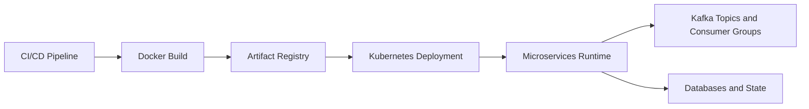

# Deployment and Runbooks

This document consolidates operational guidance for Docker, Kubernetes, Jenkins, Kafka operations, OAuth setup, and service runtime checks.

## Runtime Topology

## Deployment Tracks

### Docker

- local containerized startup and environment consistency guidance
- service-level setup patterns

### Kubernetes

- service deployment examples and local cluster deployment references

### Jenkins

- pipeline architecture, quickstart, and customization guidance consolidated

## Messaging Operations

Kafka operational tasks consolidated:

- topic reference and usage context
- offset reset procedures
- troubleshooting lag/consumer behavior

## Authentication and Platform Setup

- Google OAuth setup guidance
- service endpoint and port alignment notes

## Standard Operational Checks

1. verify all required services are healthy
2. verify Kafka topics and consumer groups are active
3. verify API gateway routes and service ports match configured values
4. verify critical feature smoke tests (notifications, budget reports)

## Related Docs

- notification runbook: `docs/features/notifications/testing-and-troubleshooting.md`
- security requirements: `docs/SECURITY.md`
- architecture/event flow: `docs/architecture/event-and-data-flows.md`

## Legacy Sources Consolidated

- `DOCKER_README.md`
- `DOCKER_SETUP.md`
- `k8s_README.md`
- `JENKINS_PIPELINE_README.md`
- `JENKINS_QUICKSTART.md`
- `PIPELINE_ARCHITECTURE.md`
- `PIPELINE_CUSTOMIZATION.md`
- `PIPELINE_SUMMARY.md`
- `KAFKA_OFFSET_RESET_GUIDE.md`
- `KAFKA_TOPICS_REFERENCE.md`
- `KAFKA_TROUBLESHOOTING_GUIDE.md`
- `GOOGLE_OAUTH_SETUP.md`
- `PORT_UPDATE_SUMMARY.md`
