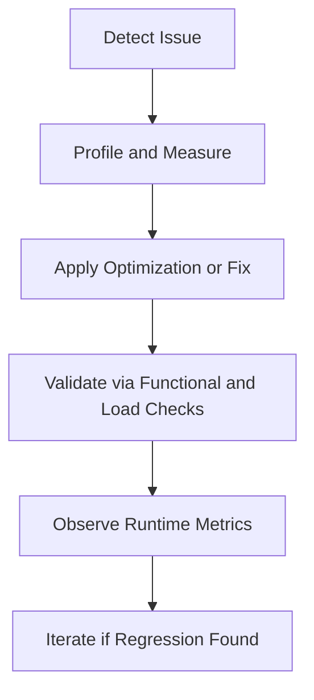

# Performance and Reliability: Optimization and Fixes

This document consolidates query optimization, notification throughput improvements, reducer performance work, and high-impact bug fixes.

## Reliability and Performance Pipeline

## Consolidated Optimization Themes

### Query and Repository Optimization

- budget repository query tuning and quick-reference guidance
- N+1 mitigation patterns and validation notes
- post-optimization summaries for data access improvements

### Notification Throughput and Responsiveness

- notification pipeline performance analysis and fixes
- batch processing improvements for notification consumers
- verification of reduced unnecessary API call behavior

### Frontend State Performance

- Redux reducer performance optimization patterns
- UI-level fixes for duplicate work and render overhead

## Consolidated Reliability Fix Themes

- payment method event contract/alignment fixes
- transaction visibility timing/ordering corrections
- WebSocket and runtime notification consistency fixes
- floating notification update/fix cycles consolidated

## Validation Checklist

1. functional correctness after optimization
2. no loss of notification events under expected load
3. no regressions in user-visible latency for key flows
4. no contract mismatch between producer and consumer DTOs
5. stable frontend state updates without duplicate rendering loops

## Related Docs

- backend service architecture: `docs/backend-services/overview.md`
- notifications feature behavior: `docs/features/notifications/overview.md`
- runtime troubleshooting: `docs/features/notifications/testing-and-troubleshooting.md`

## Legacy Sources Consolidated

- `QUERY_OPTIMIZATION_GUIDE.md`
- `QUERY_OPTIMIZATION_QUICK_REFERENCE.md`
- `N+1_QUERY_FIX_DOCUMENTATION.md`
- `OPTIMIZATION_SUMMARY.md`
- `PERFORMANCE_OPTIMIZATION_SUMMARY.md`
- `NOTIFICATION_PERFORMANCE_ANALYSIS.md`
- `NOTIFICATION_PERFORMANCE_FIX.md`
- `BATCH_NOTIFICATION_PROCESSING_GUIDE.md`
- `REDUX_REDUCER_PERFORMANCE_OPTIMIZATION.md`
- `TRANSACTION_VISIBILITY_FIX.md`
- `PAYMENT_METHOD_EVENT_FIX.md`
- `UPDATES_AND_FIXES.md`
- `FINAL_VERIFICATION_ZERO_API_CALLS.md`
