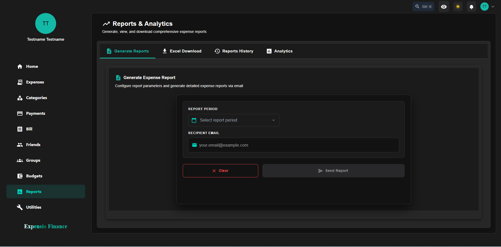
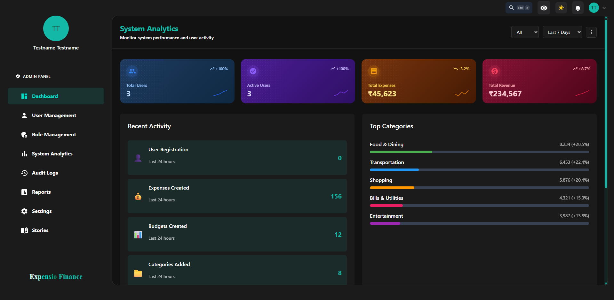
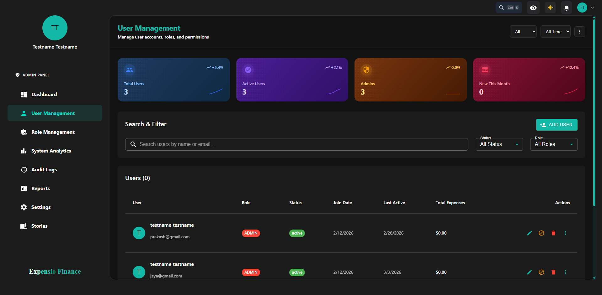
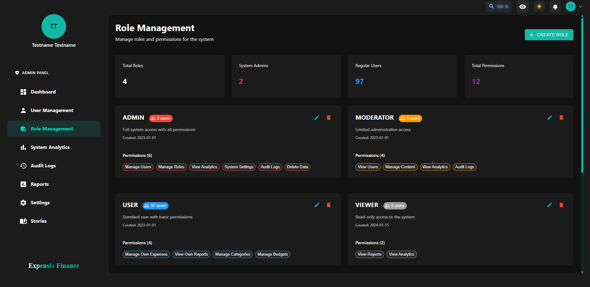
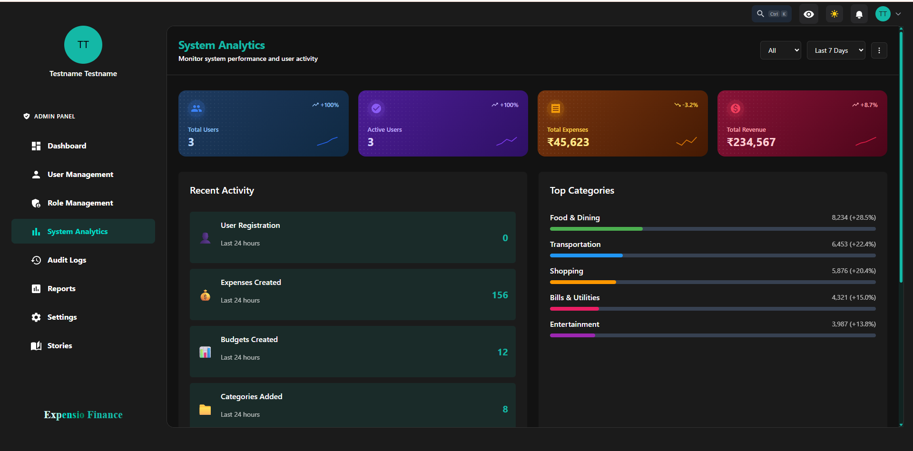

# Expense Tracking Frontend

Frontend for the Expense Tracking System. This app supports personal finance management, friend-based collaboration, reports, sharing, and admin operations.

## Overview

The frontend is built with React + Redux and uses centralized API/WebSocket configuration from `src/config/api.js`.

## Screenshots

The images below are loaded from `docs/screenshots/**`.

### Reports



### Admin Dashboard



### Admin User Management



### Admin Role Management



### Admin System Analytics



## Tech Stack

| Area | Technology |
|------|------------|
| UI | React 18, MUI, Bootstrap |
| Routing | `react-router-dom` |
| State | Redux + `redux-thunk` |
| Forms | Formik + Yup |
| Charts | Chart.js, Recharts |
| HTTP | Axios |
| Realtime | STOMP/SockJS + Socket services |
| Auth | JWT + Google OAuth |
| Testing | React Testing Library + Jest DOM |

## Features and Routes

### Authentication

| Feature | Routes |
|---------|--------|
| Login/Register | `/`, `/login`, `/register` |
| Password Recovery | `/forgot-password`, `/create-password` |
| OTP/MFA | `/otp-verification`, `/mfa`, `/settings/mfa` |
| Google OAuth | Login flow + callback |

### Dashboard and Core Navigation

| Feature | Routes |
|---------|--------|
| Main Dashboard | `/dashboard` |
| Reports Hub | `/reports`, `/reports/:friendId` |
| Transactions/History/Insights | `/transactions`, `/history`, `/insights` |
| Utilities | `/utilities` |

### Expenses

| Feature | Routes |
|---------|--------|
| Expense List | `/expenses`, `/expenses/:friendId` |
| Create/Edit/View | `/expenses/create`, `/expenses/edit/:id`, `/expenses/view/:id` |
| Expense Reports | `/expenses/reports`, `/expenses/reports/:friendId` |
| Cashflow Views | `/cashflow`, `/cashflow/:friendId` |

### Categories

| Feature | Routes |
|---------|--------|
| Category Flow | `/category-flow`, `/category-flow/:friendId` |
| Create/Edit | `/category-flow/create`, `/category-flow/edit/:id` |
| Reports/Analytics | `/category-flow/reports`, `/category-flow/view/:categoryId` |
| Calendar | `/category-flow/calendar` |

### Payment Methods

| Feature | Routes |
|---------|--------|
| Payment Method Flow | `/payment-method`, `/payment-method/:friendId` |
| Create/Edit | `/payment-method/create`, `/payment-method/edit/:id` |
| Reports/Analytics | `/payment-method/reports`, `/payment-method/view/:paymentMethodId` |
| Calendar | `/payment-method/calendar` |

### Bills

| Feature | Routes |
|---------|--------|
| Bill List | `/bill`, `/bill/:friendId` |
| Create/Edit | `/bill/create`, `/bill/edit/:id` |
| Bill Upload | `/bill/upload` |
| Bill Reports/Calendar | `/bill/report`, `/bill/calendar` |

### Budgets

| Feature | Routes |
|---------|--------|
| Budget List | `/budget`, `/budget/:friendId` |
| Create/Edit | `/budget/create`, `/budget/edit/:id` |
| Budget Reports | `/budget/report/:id`, `/budget/reports`, `/budget-report/:budgetId` |

### Friends and Groups

| Feature | Routes |
|---------|--------|
| Friends | `/friends`, `/friends/report`, `/friends/activity` |
| Friend Expense View | `/friends/expenses/:friendId` |
| Groups | `/groups`, `/groups/create`, `/groups/:id` |
| Chat | `/chats`, `/friend-chat` |

### Sharing

| Feature | Routes |
|---------|--------|
| My Shares | `/my-shares`, `/my-shares/create` |
| Public/Received Shares | `/public-shares`, `/shared-with-me` |
| Public Share Token | `/share/:token` |

### Admin

| Feature | Routes |
|---------|--------|
| Dashboard/Analytics | `/admin/dashboard`, `/admin/analytics` |
| Users/Roles | `/admin/users`, `/admin/roles` |
| Audit/Reports/Settings | `/admin/audit`, `/admin/reports`, `/admin/settings` |
| Story Management | `/admin/stories`, `/admin/stories/create`, `/admin/stories/edit/:id` |

### Upload and Calendar Views

| Feature | Routes |
|---------|--------|
| Upload Expenses/Categories/Payments | `/upload/expenses`, `/upload/categories`, `/upload/payments` |
| Calendar Views | `/calendar-view`, `/day-view/:date`, `/bill-day-view/:date` |

## Folder Structure

```text
expense-tracking-frontend/
|-- docs/
|   `-- screenshots/
|       |-- Reports/
|       `-- Admin/
|-- public/
|-- src/
|   |-- App.js
|   |-- index.js
|   |-- routes/
|   |   `-- AppRoutes.js
|   |-- pages/
|   |-- features/
|   |-- components/
|   |-- Redux/
|   |-- config/
|   |-- hooks/
|   |-- services/
|   |-- utils/
|   `-- i18n/
|-- .env.example
`-- package.json
```

## Setup

1. Install dependencies:

```bash
npm install
```

2. Create environment file from example:

```bash
# macOS/Linux
cp .env.example .env

# Windows (PowerShell)
Copy-Item .env.example .env
```

3. Start the app:

```bash
npm start
```

## Environment Variables

| Variable | Default | Purpose |
|----------|---------|---------|
| `REACT_APP_API_BASE_URL` | `http://localhost:8080` | Base API URL |
| `REACT_APP_GOOGLE_CLIENT_ID` | fallback in config | Google OAuth client ID |
| `REACT_APP_NOTIFICATION_WS_URL` | `${REACT_APP_API_BASE_URL}/notifications` | Notification WS endpoint |
| `REACT_APP_CHAT_WS_URL` | `${REACT_APP_API_BASE_URL}/chat` | Chat WS endpoint |
| `REACT_APP_STORY_WS_URL` | `${REACT_APP_API_BASE_URL}/ws-stories` | Story WS endpoint |

## Scripts

| Command | Description |
|---------|-------------|
| `npm start` | Run development server |
| `npm run build` | Build production bundle |
| `npm test` | Run test runner |
| `npm run eject` | Eject CRA config |
